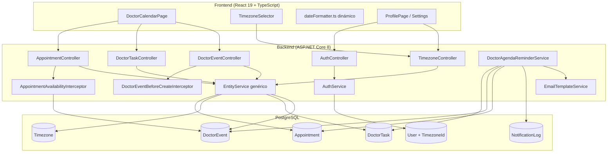
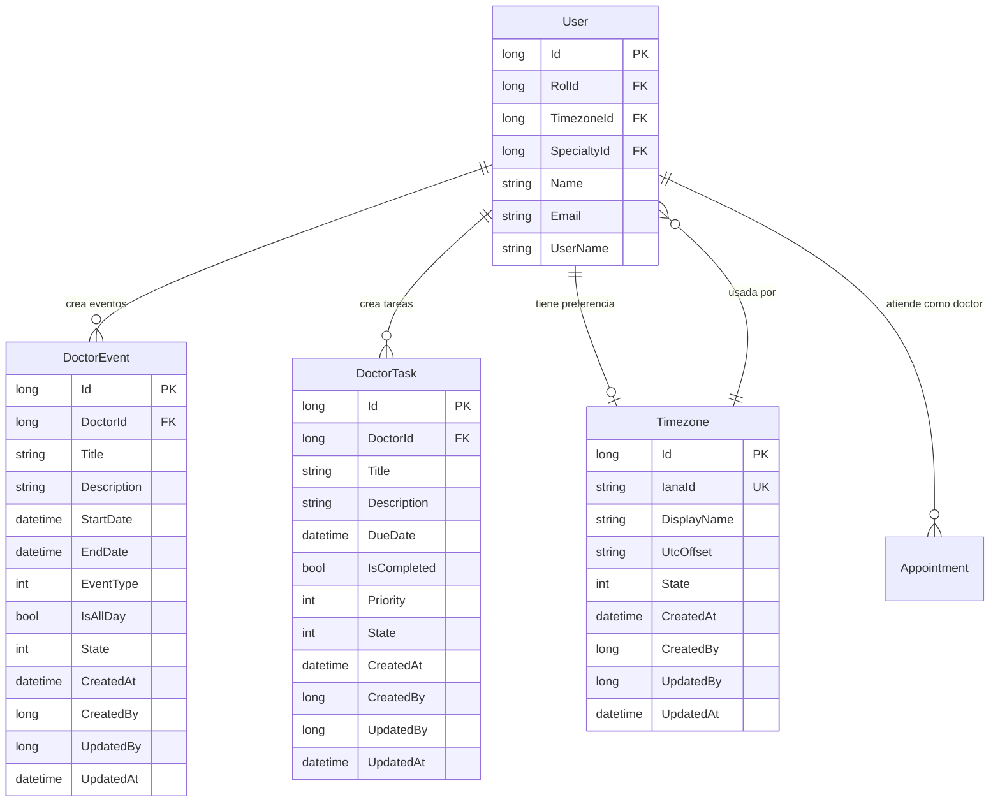

# Documento de Diseño Técnico — Calendario del Doctor y Configuración de Zona Horaria

## Resumen General

Este documento describe el diseño técnico para tres funcionalidades complementarias del Sistema de Información Hospitalaria (HIS):

- **Área 1 — Calendario / Agenda del Doctor (Requisitos 1–3):** Vista de calendario dedicada para médicos con citas, eventos personales/bloqueos de disponibilidad y tareas/recordatorios. Soporta vistas de día, semana y mes. Incluye las nuevas entidades `DoctorEvent` y `DoctorTask` con patrón CRUD completo.
- **Área 2 — Zona Horaria Configurable (Requisitos 4–6):** Tabla de catálogo `Timezone` con zonas IANA sembrada por migración EF, preferencia de zona horaria por usuario (`TimezoneId` en `User`), integración con `dateFormatter.ts` para lectura dinámica desde el estado de autenticación, y "America/Guatemala" como valor por defecto.
- **Área 3 — Notificaciones de Recordatorio (Requisito 7):** Servicio de background `DoctorAgendaReminderService` que envía resumen diario, recordatorios a 1 hora y 15 minutos antes de actividades, y notificación inmediata al agendar nueva cita. Usa `EmailTemplateService` con nuevos tipos de plantilla y registra en `NotificationLog`.

El diseño se alinea con la arquitectura existente: backend ASP.NET Core 8 con patrón `EntityService<TEntity, TRequest, TId>` + `CrudController`, validación con FluentValidation, mapeo con Mapster, y frontend React 19 + TypeScript + Vite + HeroUI + TailwindCSS.

---

## Arquitectura

### Diagrama de Arquitectura General



### Decisiones Arquitectónicas

1. **Reutilización del patrón EntityService + CrudController:** Las tres nuevas entidades (`DoctorEvent`, `DoctorTask`, `Timezone`) seguirán el patrón CRUD genérico existente con sus respectivos Request, Response, Validators, Mappers, Configuration y Controller.

2. **Biblioteca de calendario frontend — FullCalendar:** Se recomienda [FullCalendar](https://fullcalendar.io/) (`@fullcalendar/react` v6) por su soporte nativo de vistas día/semana/mes, drag-and-drop, integración con React 19, y licencia MIT. Alternativas evaluadas: `react-big-calendar` (menos flexible en personalización de eventos), implementación custom (costo de desarrollo excesivo). FullCalendar permite renderizar eventos con colores personalizados por tipo y estado, lo cual es esencial para diferenciar citas, eventos y tareas.

3. **Bloqueo de disponibilidad mediante interceptor:** Se creará un `AppointmentBeforeCreateInterceptor` mejorado (o se extenderá el existente) que consulte `DoctorEvent` para verificar que el horario solicitado no se superponga con eventos personales activos del médico. Esto se ejecuta en el servidor al crear una cita, garantizando consistencia.

4. **Zona horaria en AuthResponse:** Se agregará el campo `TimezoneIanaId` a `AuthResponse` para que el frontend reciba la zona horaria del usuario al iniciar sesión. El frontend almacenará este valor en `localStorage` junto con el resto del estado de auth, y `dateFormatter.ts` lo leerá dinámicamente.

5. **Modificación de User:** Se agrega `TimezoneId` (FK nullable a `Timezone`) en la entidad `User`. Cuando es `null`, el sistema usa "America/Guatemala" como valor por defecto. La migración EF incluirá el campo y la FK.

6. **Servicio de background para recordatorios:** `DoctorAgendaReminderService` se implementa como `BackgroundService` (igual que `AppointmentReminderService`), ejecutándose cada 5 minutos. Usa `NotificationLog` para evitar duplicados y registrar trazabilidad.

7. **Nuevos tipos de notificación en NotificationLog:** Se extiende el enum implícito de `NotificationType` con valores: 7=DailyAgenda, 8=Reminder1h, 9=Reminder15m, 10=NewAppointmentNotification, 11=EventReminder1h, 12=EventReminder15m.

8. **Seed de zonas horarias por migración EF:** La migración insertará las 16+ zonas horarias IANA requeridas usando `migrationBuilder.InsertData()`, no en `OnModelCreating`. Esto mantiene la separación entre esquema y datos.

---

## Componentes e Interfaces

### Área 1 — Calendario / Agenda del Doctor

#### 1.1 Nueva Entidad DoctorEvent (Requisito 2)

**Entidad `DoctorEvent` — `Hospital.Server/Entities/Models/DoctorEvent.cs`:**
```csharp
public class DoctorEvent : IEntity<long>
{
    public long Id { get; set; }
    public long DoctorId { get; set; }           // FK a User
    public string Title { get; set; } = string.Empty; // 3–200 chars
    public string? Description { get; set; }      // max 500 chars
    public DateTime StartDate { get; set; }
    public DateTime EndDate { get; set; }
    public int EventType { get; set; }            // 0=Reunión, 1=Descanso, 2=Capacitación, 3=Personal, 4=Otro
    public bool IsAllDay { get; set; }
    // Campos de auditoría estándar
    public int State { get; set; } = 1;
    public DateTime CreatedAt { get; set; }
    public long CreatedBy { get; set; }
    public long? UpdatedBy { get; set; }
    public DateTime? UpdatedAt { get; set; }
    // Navegación
    public virtual User? Doctor { get; set; }
}
```

**Controlador `DoctorEventController`:**
```csharp
[ModuleInfo(
    DisplayName = "Eventos del Doctor",
    Description = "Gestión de eventos personales y bloqueos de disponibilidad del médico",
    Icon = "bi-calendar-event",
    Path = "doctor-event",
    Order = 20,
    IsVisible = false
)]
[Route("api/v1/[controller]")]
public class DoctorEventController : CrudController<DoctorEvent, DoctorEventRequest, DoctorEventResponse, long>
{
    public DoctorEventController(IEntityService<DoctorEvent, DoctorEventRequest, long> service)
        : base(service) { }
}
```

**Interceptor `DoctorEventBeforeCreateInterceptor`:**
- Valida que `StartDate < EndDate`.
- Valida que no exista superposición con otro `DoctorEvent` activo (State=1) del mismo `DoctorId`.
- Si `IsAllDay=true`, ajusta `StartDate` a 00:00 UTC y `EndDate` a 23:59 UTC de la fecha seleccionada.
- Valida que `DoctorId` corresponda al usuario autenticado (inyectado desde JWT claims).

#### 1.2 Nueva Entidad DoctorTask (Requisito 3)

**Entidad `DoctorTask` — `Hospital.Server/Entities/Models/DoctorTask.cs`:**
```csharp
public class DoctorTask : IEntity<long>
{
    public long Id { get; set; }
    public long DoctorId { get; set; }           // FK a User
    public string Title { get; set; } = string.Empty; // 3–200 chars
    public string? Description { get; set; }      // max 1000 chars
    public DateTime DueDate { get; set; }
    public bool IsCompleted { get; set; } = false;
    public int Priority { get; set; } = 1;        // 0=Baja, 1=Normal, 2=Alta
    // Campos de auditoría estándar
    public int State { get; set; } = 1;
    public DateTime CreatedAt { get; set; }
    public long CreatedBy { get; set; }
    public long? UpdatedBy { get; set; }
    public DateTime? UpdatedAt { get; set; }
    // Navegación
    public virtual User? Doctor { get; set; }
}
```

**Controlador `DoctorTaskController`:**
```csharp
[ModuleInfo(
    DisplayName = "Tareas del Doctor",
    Description = "Gestión de tareas y recordatorios personales del médico",
    Icon = "bi-check2-square",
    Path = "doctor-task",
    Order = 21,
    IsVisible = false
)]
[Route("api/v1/[controller]")]
public class DoctorTaskController : CrudController<DoctorTask, DoctorTaskRequest, DoctorTaskResponse, long>
{
    public DoctorTaskController(IEntityService<DoctorTask, DoctorTaskRequest, long> service)
        : base(service) { }
}
```

**Interceptor `DoctorTaskBeforeCreateInterceptor`:**
- Valida que `DoctorId` corresponda al usuario autenticado.

#### 1.3 Vista de Calendario del Doctor (Requisito 1)

**Frontend — Nueva página `DoctorCalendarPage.tsx`:**
- Ruta: `/doctor-calendar`
- Usa `@fullcalendar/react` con plugins: `dayGridPlugin` (mes), `timeGridPlugin` (día/semana), `interactionPlugin` (click en eventos).
- Carga datos de tres fuentes al cambiar rango de fechas visible:
  - `GET /api/v1/Appointment?filters=DoctorId=={userId},AppointmentDate>={start},AppointmentDate<={end}`
  - `GET /api/v1/DoctorEvent?filters=DoctorId=={userId},StartDate<={end},EndDate>={start},State==1`
  - `GET /api/v1/DoctorTask?filters=DoctorId=={userId},DueDate>={start},DueDate<={end},State==1`
- Mapea cada tipo a eventos de FullCalendar con colores diferenciados:
  - Citas: azul (pendiente), verde (confirmada), amarillo (en progreso), gris (completada)
  - Eventos personales: morado
  - Tareas: naranja (pendiente), gris tachado (completada)
- Click en cita → redirige a `/dashboard` (DoctorDashboardPage existente).
- Click en evento → abre modal de edición del evento.
- Click en tarea → abre modal de edición/completar tarea.
- Panel lateral "Tareas del Día" con filtro por estado y ordenamiento por prioridad.

**Paquetes npm a instalar:**
```
@fullcalendar/react @fullcalendar/daygrid @fullcalendar/timegrid @fullcalendar/interaction
```

#### 1.4 Bloqueo de Disponibilidad (Requisito 2.5)

**Extensión del `AppointmentBeforeCreateInterceptor` existente:**
```
Al crear una cita:
1. Obtener DoctorId de la cita (puede ser asignado automáticamente o seleccionado)
2. Consultar DoctorEvents activos (State=1) del doctor que se superpongan con AppointmentDate ± duración
3. Si existe superposición → rechazar con error "El médico tiene un bloqueo de disponibilidad en ese horario"
4. Continuar con la lógica existente del interceptor
```

Esto aplica tanto para citas creadas desde el panel administrativo como desde el portal del paciente.

---

### Área 2 — Zona Horaria Configurable

#### 2.1 Nueva Entidad Timezone (Requisito 4)

**Entidad `Timezone` — `Hospital.Server/Entities/Models/Timezone.cs`:**
```csharp
public class Timezone : IEntity<long>
{
    public long Id { get; set; }
    public string IanaId { get; set; } = string.Empty;       // "America/Guatemala", max 100
    public string DisplayName { get; set; } = string.Empty;   // "(UTC-06:00) America/Guatemala", max 200
    public string UtcOffset { get; set; } = string.Empty;     // "-06:00"
    // Campos de auditoría estándar
    public int State { get; set; } = 1;
    public DateTime CreatedAt { get; set; }
    public long CreatedBy { get; set; }
    public long? UpdatedBy { get; set; }
    public DateTime? UpdatedAt { get; set; }
}
```

**Controlador `TimezoneController`:**
```csharp
[ModuleInfo(
    DisplayName = "Zonas Horarias",
    Description = "Catálogo de zonas horarias IANA del sistema",
    Icon = "bi-globe",
    Path = "timezone",
    Order = 22,
    IsVisible = false
)]
[Route("api/v1/[controller]")]
public class TimezoneController : CrudController<Timezone, TimezoneRequest, TimezoneResponse, long>
{
    public TimezoneController(IEntityService<Timezone, TimezoneRequest, long> service)
        : base(service) { }
}
```

**Migración EF con seed de zonas horarias:**
La migración insertará las siguientes zonas horarias mínimas:

| IanaId | DisplayName | UtcOffset |
|--------|-------------|-----------|
| America/Guatemala | (UTC-06:00) America/Guatemala | -06:00 |
| America/Mexico_City | (UTC-06:00) America/Mexico_City | -06:00 |
| America/New_York | (UTC-05:00) America/New_York | -05:00 |
| America/Chicago | (UTC-06:00) America/Chicago | -06:00 |
| America/Denver | (UTC-07:00) America/Denver | -07:00 |
| America/Los_Angeles | (UTC-08:00) America/Los_Angeles | -08:00 |
| America/Bogota | (UTC-05:00) America/Bogota | -05:00 |
| America/Lima | (UTC-05:00) America/Lima | -05:00 |
| America/Santiago | (UTC-04:00) America/Santiago | -04:00 |
| America/Argentina/Buenos_Aires | (UTC-03:00) America/Argentina/Buenos_Aires | -03:00 |
| America/Sao_Paulo | (UTC-03:00) America/Sao_Paulo | -03:00 |
| Europe/London | (UTC+00:00) Europe/London | +00:00 |
| Europe/Madrid | (UTC+01:00) Europe/Madrid | +01:00 |
| Europe/Berlin | (UTC+01:00) Europe/Berlin | +01:00 |
| Asia/Tokyo | (UTC+09:00) Asia/Tokyo | +09:00 |
| UTC | (UTC+00:00) UTC | +00:00 |

#### 2.2 Modificación de la Entidad User (Requisito 5)

**Cambios en `User.cs`:**
```csharp
// Nuevo campo — agregar después de SpecialtyId
public long? TimezoneId { get; set; }
public virtual Timezone? Timezone { get; set; }
```

**Cambios en `UserConfiguration.cs`:**
```csharp
// Agregar FK a Timezone
entity.HasOne(e => e.Timezone)
    .WithMany()
    .HasForeignKey(e => e.TimezoneId)
    .OnDelete(DeleteBehavior.SetNull)
    .IsRequired(false);
```

**Cambios en `UserRequest.cs`:**
```csharp
public long? TimezoneId { get; set; }
```

**Cambios en `UserResponse.cs`:**
```csharp
public long? TimezoneId { get; set; }
public string? TimezoneIanaId { get; set; }
public string? TimezoneDisplayName { get; set; }
```

#### 2.3 Modificación de AuthResponse (Requisito 5.6)

**Cambios en `AuthResponse.cs`:**
```csharp
// Nuevo campo
public string TimezoneIanaId { get; set; } = "America/Guatemala";
```

**Cambios en `AuthService` (método Login):**
Al construir el `AuthResponse`, incluir la zona horaria del usuario:
```csharp
TimezoneIanaId = user.Timezone?.IanaId ?? "America/Guatemala"
```
Esto requiere hacer `Include(u => u.Timezone)` en la consulta de login.

#### 2.4 Integración Frontend con dateFormatter.ts (Requisito 6)

**Cambios en `InitialAuth.ts`:**
```typescript
export interface InitialAuth {
  // ... campos existentes
  timezoneIanaId: string; // Nuevo campo
}
```

**Cambios en `constants.ts`:**
```typescript
export const authInitialState: InitialAuth = {
  // ... campos existentes
  timezoneIanaId: "America/Guatemala", // Valor por defecto
};
```

**Cambios en `dateFormatter.ts`:**
```typescript
// Reemplazar la constante hardcodeada:
// export const APP_TIMEZONE = "America/Guatemala";

// Por una función que lee del estado de auth:
const DEFAULT_TIMEZONE = "America/Guatemala";

function getAppTimezone(): string {
  try {
    const storedState = window.localStorage.getItem("@auth");
    if (storedState) {
      const auth = JSON.parse(storedState);
      return auth.timezoneIanaId || DEFAULT_TIMEZONE;
    }
  } catch {
    // Fallback silencioso
  }
  return DEFAULT_TIMEZONE;
}

// Exportar como getter para compatibilidad
export const APP_TIMEZONE = /* se reemplaza en cada función */;
```

Cada función de formateo (`formatDate`, `formatDateTime`, etc.) llamará a `getAppTimezone()` en lugar de usar la constante, garantizando que siempre use la zona horaria actual del usuario sin necesidad de recargar la página.

**Selector de zona horaria en el frontend:**
- Componente `TimezoneSelector.tsx` que usa `<Select>` de HeroUI.
- Carga opciones desde `GET /api/v1/Timezone?filters=State==1`.
- Muestra `DisplayName` como label.
- Al cambiar, envía `PATCH /api/v1/User` con `{ timezoneId: selectedId }`.
- Actualiza `timezoneIanaId` en el auth store y `localStorage`.
- Se integra en: página de configuración del panel administrativo y `/portal/profile` del portal del paciente.

---

### Área 3 — Notificaciones de Recordatorio

#### 3.1 Servicio de Background DoctorAgendaReminderService (Requisito 7)

**`Hospital.Server/Services/Background/DoctorAgendaReminderService.cs`:**

Servicio `BackgroundService` que se ejecuta cada 5 minutos y maneja cuatro tipos de notificación:

```
Flujo de ejecución (cada 5 minutos):
1. Obtener hora actual UTC
2. Para cada médico activo (User con Rol de médico, State=1):
   a. Obtener su zona horaria (User.Timezone.IanaId ?? "America/Guatemala")
   b. Convertir hora UTC a hora local del médico
   c. RESUMEN DIARIO: Si hora local ≈ 06:00 (ventana 05:55–06:05) y no se envió hoy:
      - Consultar citas, eventos y tareas del día
      - Si hay actividades → enviar correo DailyAgendaSummary
      - Registrar en NotificationLog (NotificationType=7)
   d. RECORDATORIO 1H: Para cada cita/evento que inicie en 55–65 minutos:
      - Si no se envió Reminder1h para esta actividad → enviar
      - Registrar en NotificationLog (NotificationType=8 para citas, 11 para eventos)
   e. RECORDATORIO 15M: Para cada cita/evento que inicie en 10–20 minutos:
      - Si no se envió Reminder15m para esta actividad → enviar
      - Registrar en NotificationLog (NotificationType=9 para citas, 12 para eventos)
```

**Conversión de zona horaria en el backend:**
```csharp
// Usar TimeZoneInfo de .NET para conversión
var tzInfo = TimeZoneInfo.FindSystemTimeZoneById(ianaId); // .NET 8 soporta IANA IDs
var localTime = TimeZoneInfo.ConvertTimeFromUtc(DateTime.UtcNow, tzInfo);
```

#### 3.2 Notificación Inmediata de Nueva Cita (Requisito 7.9)

**Extensión del `AppointmentAfterCreateInterceptor` o nuevo interceptor `AppointmentAfterCreateNotifyDoctorInterceptor`:**
- Después de crear una cita con `DoctorId` asignado:
  1. Obtener datos del médico (email, nombre, zona horaria).
  2. Enviar correo con plantilla `NewAppointmentNotification`.
  3. Registrar en `NotificationLog` (NotificationType=10).

#### 3.3 Nuevos Tipos de Plantilla de Email

**Extensión de `EmailTemplateType`:**
```csharp
public enum EmailTemplateType
{
    PasswordRecovery = 0,
    PasswordChangeConfirmation = 1,
    AppointmentConfirmation = 2,
    PaymentConfirmation = 3,
    // Nuevos tipos para agenda del doctor
    DailyAgendaSummary = 4,
    AppointmentReminder = 5,
    EventReminder = 6,
    NewAppointmentNotification = 7
}
```

**Plantilla `DailyAgendaSummary`:**
- Placeholders: `{{NombreDoctor}}`, `{{Fecha}}`, `{{TablaCitas}}`, `{{TablaEventos}}`, `{{TablaTareas}}`
- Muestra tabla con hora, paciente/título, especialidad/tipo para cada actividad del día.

**Plantilla `AppointmentReminder`:**
- Placeholders: `{{NombreDoctor}}`, `{{TiempoRestante}}`, `{{NombrePaciente}}`, `{{Especialidad}}`, `{{HoraCita}}`, `{{Sucursal}}`

**Plantilla `EventReminder`:**
- Placeholders: `{{NombreDoctor}}`, `{{TiempoRestante}}`, `{{TituloEvento}}`, `{{TipoEvento}}`, `{{HoraInicio}}`, `{{HoraFin}}`

**Plantilla `NewAppointmentNotification`:**
- Placeholders: `{{NombreDoctor}}`, `{{NombrePaciente}}`, `{{FechaCita}}`, `{{HoraCita}}`, `{{Especialidad}}`, `{{MotivoCita}}`

#### 3.4 Registro en ServicesGroup.cs

```csharp
// Doctor Calendar CRUD services
services.AddScoped<IEntityService<DoctorEvent, DoctorEventRequest, long>,
    EntityService<DoctorEvent, DoctorEventRequest, long>>();
services.AddScoped<IEntityService<DoctorTask, DoctorTaskRequest, long>,
    EntityService<DoctorTask, DoctorTaskRequest, long>>();
services.AddScoped<IEntityService<Timezone, TimezoneRequest, long>,
    EntityService<Timezone, TimezoneRequest, long>>();

// Doctor Event interceptors
services.AddScoped<IEntityBeforeCreateInterceptor<DoctorEvent, DoctorEventRequest>,
    DoctorEventBeforeCreateInterceptor>();
services.AddScoped<IEntityBeforeCreateInterceptor<DoctorTask, DoctorTaskRequest>,
    DoctorTaskBeforeCreateInterceptor>();

// Background service para recordatorios de agenda del doctor
services.AddHostedService<DoctorAgendaReminderService>();
```

---

## Modelos de Datos

### Diagrama Entidad-Relación



### Configuraciones de Entidad (EF Core)

**`DoctorEventConfiguration.cs`** en `Hospital.Server/Context/Config/`:
```csharp
public class DoctorEventConfiguration : IEntityTypeConfiguration<DoctorEvent>
{
    public void Configure(EntityTypeBuilder<DoctorEvent> builder)
    {
        builder.ToTable("DoctorEvents");
        builder.HasKey(e => e.Id);
        builder.Property(e => e.Id).ValueGeneratedOnAdd();

        builder.Property(e => e.Title).HasMaxLength(200).IsRequired();
        builder.Property(e => e.Description).HasMaxLength(500);
        builder.Property(e => e.StartDate).IsRequired();
        builder.Property(e => e.EndDate).IsRequired();
        builder.Property(e => e.EventType).IsRequired();

        builder.HasOne(e => e.Doctor)
            .WithMany()
            .HasForeignKey(e => e.DoctorId)
            .OnDelete(DeleteBehavior.Restrict);

        builder.HasIndex(e => e.DoctorId);
        builder.HasIndex(e => e.StartDate);
        builder.HasIndex(e => e.EndDate);
    }
}
```

**`DoctorTaskConfiguration.cs`** en `Hospital.Server/Context/Config/`:
```csharp
public class DoctorTaskConfiguration : IEntityTypeConfiguration<DoctorTask>
{
    public void Configure(EntityTypeBuilder<DoctorTask> builder)
    {
        builder.ToTable("DoctorTasks");
        builder.HasKey(e => e.Id);
        builder.Property(e => e.Id).ValueGeneratedOnAdd();

        builder.Property(e => e.Title).HasMaxLength(200).IsRequired();
        builder.Property(e => e.Description).HasMaxLength(1000);
        builder.Property(e => e.DueDate).IsRequired();
        builder.Property(e => e.Priority).HasDefaultValue(1);
        builder.Property(e => e.IsCompleted).HasDefaultValue(false);

        builder.HasOne(e => e.Doctor)
            .WithMany()
            .HasForeignKey(e => e.DoctorId)
            .OnDelete(DeleteBehavior.Restrict);

        builder.HasIndex(e => e.DoctorId);
        builder.HasIndex(e => e.DueDate);
        builder.HasIndex(e => e.IsCompleted);
    }
}
```

**`TimezoneConfiguration.cs`** en `Hospital.Server/Context/Config/`:
```csharp
public class TimezoneConfiguration : IEntityTypeConfiguration<Timezone>
{
    public void Configure(EntityTypeBuilder<Timezone> builder)
    {
        builder.ToTable("Timezones");
        builder.HasKey(e => e.Id);
        builder.Property(e => e.Id).ValueGeneratedOnAdd();

        builder.Property(e => e.IanaId).HasMaxLength(100).IsRequired();
        builder.Property(e => e.DisplayName).HasMaxLength(200).IsRequired();
        builder.Property(e => e.UtcOffset).HasMaxLength(10).IsRequired();

        builder.HasIndex(e => e.IanaId).IsUnique();
    }
}
```

### DTOs Nuevos

**`DoctorEventRequest.cs`:**
```csharp
public class DoctorEventRequest : IRequest<long?>
{
    public long? Id { get; set; }
    public long? DoctorId { get; set; }
    public string? Title { get; set; }
    public string? Description { get; set; }
    public DateTime? StartDate { get; set; }
    public DateTime? EndDate { get; set; }
    public int? EventType { get; set; }
    public bool? IsAllDay { get; set; }
    public int? State { get; set; }
    public long? CreatedBy { get; set; }
    public long? UpdatedBy { get; set; }
}
```

**`DoctorEventResponse.cs`:**
```csharp
public class DoctorEventResponse
{
    public long Id { get; set; }
    public long DoctorId { get; set; }
    public string Title { get; set; } = string.Empty;
    public string? Description { get; set; }
    public string StartDate { get; set; } = string.Empty;
    public string EndDate { get; set; } = string.Empty;
    public int EventType { get; set; }
    public bool IsAllDay { get; set; }
    public int State { get; set; }
    public string CreatedAt { get; set; } = string.Empty;
    public long CreatedBy { get; set; }
    public long? UpdatedBy { get; set; }
    public string? UpdatedAt { get; set; }
    // Datos del doctor para display
    public string? DoctorName { get; set; }
}
```

**`DoctorTaskRequest.cs`:**
```csharp
public class DoctorTaskRequest : IRequest<long?>
{
    public long? Id { get; set; }
    public long? DoctorId { get; set; }
    public string? Title { get; set; }
    public string? Description { get; set; }
    public DateTime? DueDate { get; set; }
    public bool? IsCompleted { get; set; }
    public int? Priority { get; set; }
    public int? State { get; set; }
    public long? CreatedBy { get; set; }
    public long? UpdatedBy { get; set; }
}
```

**`DoctorTaskResponse.cs`:**
```csharp
public class DoctorTaskResponse
{
    public long Id { get; set; }
    public long DoctorId { get; set; }
    public string Title { get; set; } = string.Empty;
    public string? Description { get; set; }
    public string DueDate { get; set; } = string.Empty;
    public bool IsCompleted { get; set; }
    public int Priority { get; set; }
    public int State { get; set; }
    public string CreatedAt { get; set; } = string.Empty;
    public long CreatedBy { get; set; }
    public long? UpdatedBy { get; set; }
    public string? UpdatedAt { get; set; }
    // Datos del doctor para display
    public string? DoctorName { get; set; }
}
```

**`TimezoneRequest.cs`:**
```csharp
public class TimezoneRequest : IRequest<long?>
{
    public long? Id { get; set; }
    public string? IanaId { get; set; }
    public string? DisplayName { get; set; }
    public string? UtcOffset { get; set; }
    public int? State { get; set; }
    public long? CreatedBy { get; set; }
    public long? UpdatedBy { get; set; }
}
```

**`TimezoneResponse.cs`:**
```csharp
public class TimezoneResponse
{
    public long Id { get; set; }
    public string IanaId { get; set; } = string.Empty;
    public string DisplayName { get; set; } = string.Empty;
    public string UtcOffset { get; set; } = string.Empty;
    public int State { get; set; }
}
```

### Validadores

**DoctorEvent — 3 validadores obligatorios:**
- `CreateDoctorEventValidator` (hereda `CreateValidator<DoctorEventRequest>`): DoctorId requerido, Title requerido (3–200 chars), StartDate requerido, EndDate requerido, EventType requerido (0–4).
- `UpdateDoctorEventValidator` (hereda `UpdateValidator<DoctorEventRequest>`): Mismas reglas que Create + Id requerido.
- `PartialDoctorEventValidator` (hereda `PartialUpdateValidator<DoctorEventRequest>`): Solo valida campos presentes.

**DoctorTask — 3 validadores obligatorios:**
- `CreateDoctorTaskValidator` (hereda `CreateValidator<DoctorTaskRequest>`): DoctorId requerido, Title requerido (3–200 chars), DueDate requerido, Priority requerido (0–2).
- `UpdateDoctorTaskValidator` (hereda `UpdateValidator<DoctorTaskRequest>`): Mismas reglas + Id requerido.
- `PartialDoctorTaskValidator` (hereda `PartialUpdateValidator<DoctorTaskRequest>`): Solo valida campos presentes.

**Timezone — 3 validadores obligatorios:**
- `CreateTimezoneValidator` (hereda `CreateValidator<TimezoneRequest>`): IanaId requerido (max 100), DisplayName requerido (max 200), UtcOffset requerido.
- `UpdateTimezoneValidator` (hereda `UpdateValidator<TimezoneRequest>`): Mismas reglas + Id requerido.
- `PartialTimezoneValidator` (hereda `PartialUpdateValidator<TimezoneRequest>`): Solo valida campos presentes.

### Mappers (Mapster)

```csharp
// DoctorEvent
TypeAdapterConfig<DoctorEventRequest, DoctorEvent>.NewConfig();
TypeAdapterConfig<DoctorEvent, DoctorEventResponse>.NewConfig()
    .Map(dest => dest.DoctorName, src => src.Doctor != null ? src.Doctor.Name : null);
TypeAdapterConfig<DoctorEvent, DoctorEvent>.NewConfig();

// DoctorTask
TypeAdapterConfig<DoctorTaskRequest, DoctorTask>.NewConfig();
TypeAdapterConfig<DoctorTask, DoctorTaskResponse>.NewConfig()
    .Map(dest => dest.DoctorName, src => src.Doctor != null ? src.Doctor.Name : null);
TypeAdapterConfig<DoctorTask, DoctorTask>.NewConfig();

// Timezone
TypeAdapterConfig<TimezoneRequest, Timezone>.NewConfig();
TypeAdapterConfig<Timezone, TimezoneResponse>.NewConfig();
TypeAdapterConfig<Timezone, Timezone>.NewConfig();
```

### Resumen de Cambios en Entidades Existentes

| Entidad | Cambio | Detalle |
|---------|--------|---------|
| `User` | Nuevo campo `TimezoneId` | FK nullable a `Timezone`. Migración EF agrega columna y FK. |
| `User` | Nueva navegación `Timezone` | Propiedad virtual para Include en consultas. |
| `UserRequest` | Nuevo campo `TimezoneId` | Permite actualizar preferencia de zona horaria vía PATCH. |
| `UserResponse` | Nuevos campos | `TimezoneId`, `TimezoneIanaId`, `TimezoneDisplayName` para display. |
| `AuthResponse` | Nuevo campo `TimezoneIanaId` | Incluido en respuesta de login para el frontend. |
| `NotificationLog` | Sin cambios de esquema | Se usan nuevos valores de `NotificationType` (7–12). |
| `AppointmentBeforeCreateInterceptor` | Extensión de lógica | Agrega verificación de superposición con `DoctorEvent`. |

---

## Correctness Properties

*A property is a characteristic or behavior that should hold true across all valid executions of a system — essentially, a formal statement about what the system should do. Properties serve as the bridge between human-readable specifications and machine-verifiable correctness guarantees.*

### Property 1: Appointment filtering by DoctorId

*For any* set of appointments and any doctor, filtering appointments by `DoctorId == doctorId` should return only appointments where `DoctorId` matches the given doctor, and no appointments belonging to other doctors should be included.

**Validates: Requirements 1.2**

### Property 2: Date range filtering returns bounded results

*For any* date range `[start, end]` and any set of appointments, filtering by date range should return only appointments with `AppointmentDate` within `[start, end]` inclusive, and no appointments outside that range should be included.

**Validates: Requirements 1.6**

### Property 3: DoctorEvent date validation and overlap detection

*For any* DoctorEvent creation request, if `StartDate >= EndDate` the system should reject it. Additionally, *for any* two DoctorEvents belonging to the same doctor where both have `State=1`, if their time ranges `[StartDate, EndDate]` overlap, the second creation should be rejected.

**Validates: Requirements 2.3**

### Property 4: Availability blocking on DoctorEvent overlap

*For any* appointment creation request where the doctor has an active DoctorEvent (`State=1`) whose time range `[StartDate, EndDate]` overlaps with the appointment's scheduled time, the system should reject the appointment creation.

**Validates: Requirements 2.5**

### Property 5: IsAllDay events span full day

*For any* DoctorEvent created with `IsAllDay=true`, the stored `StartDate` should be set to 00:00:00 UTC and `EndDate` should be set to 23:59:59 UTC of the selected date, effectively blocking the entire day.

**Validates: Requirements 2.7**

### Property 6: Ownership validation for doctor entities

*For any* DoctorEvent or DoctorTask creation request, if the `DoctorId` in the request does not match the authenticated user's ID, the system should reject the request.

**Validates: Requirements 2.8, 3.6**

### Property 7: Task priority sorting

*For any* list of DoctorTasks with mixed priorities, sorting by priority descending should produce tasks ordered Alta (2) first, then Normal (1), then Baja (0). No task with lower priority should appear before a task with higher priority.

**Validates: Requirements 3.5**

### Property 8: Task status filtering

*For any* set of DoctorTasks and a filter value (all, pending, completed), the filtered result should contain only tasks matching the criteria: "pending" returns only `IsCompleted=false`, "completed" returns only `IsCompleted=true`, "all" returns all tasks regardless of completion status.

**Validates: Requirements 3.7**

### Property 9: Default timezone fallback

*For any* user with `TimezoneId=null` (backend) or missing `timezoneIanaId` in auth state (frontend), the resolved timezone should be `"America/Guatemala"`. This applies both to the `AuthResponse.TimezoneIanaId` field and to the `getAppTimezone()` function in `dateFormatter.ts`.

**Validates: Requirements 5.2, 6.3**

### Property 10: AuthResponse timezone correctness

*For any* user who logs in successfully, the `AuthResponse.TimezoneIanaId` should equal `User.Timezone.IanaId` when `TimezoneId` is not null, or `"America/Guatemala"` when `TimezoneId` is null.

**Validates: Requirements 5.6**

### Property 11: TimezoneId validation on user update

*For any* user update request containing a `TimezoneId` value, if that value does not correspond to an existing `Timezone` record with `State=1`, the system should reject the update.

**Validates: Requirements 5.7**

### Property 12: dateFormatter works with any valid IANA timezone

*For any* valid IANA timezone identifier and any valid date string, all formatting functions (`formatDate`, `formatDateTime`, `formatDateTimeFull`, `formatTime`, `formatDateLong`, `formatDateShort`, `formatDateTimeLong`) should produce a non-empty, non-error string output without throwing exceptions.

**Validates: Requirements 6.1, 6.5**

### Property 13: Reminder window calculation is timezone-aware

*For any* doctor with timezone `T` and any activity at UTC time `U`, converting `U` to local time using `T` and then checking if the current local time falls within the 1-hour window `[localTime - 65min, localTime - 55min]` or the 15-minute window `[localTime - 20min, localTime - 10min]` should correctly identify whether a reminder should be sent.

**Validates: Requirements 7.2, 7.3, 7.8**

### Property 14: Reminder deduplication via NotificationLog

*For any* activity and notification type, if a `NotificationLog` entry already exists with `RelatedEntityType`, `RelatedEntityId`, and `NotificationType` matching the activity and reminder type with `Status=1` (Sent), the system should not send a duplicate reminder.

**Validates: Requirements 7.6**

### Property 15: Skip daily summary for empty agenda

*For any* doctor with zero appointments, zero DoctorEvents, and zero DoctorTasks on a given day, the daily summary generation should produce no email (skip sending).

**Validates: Requirements 7.7**

---

## Error Handling

### Backend

| Escenario | Código HTTP | Mensaje |
|-----------|-------------|---------|
| DoctorEvent con StartDate >= EndDate | 400 Bad Request | "La fecha de inicio debe ser anterior a la fecha de fin" |
| DoctorEvent superpuesto con otro evento del mismo médico | 400 Bad Request | "El evento se superpone con otro evento existente en su calendario" |
| DoctorEvent/DoctorTask con DoctorId != usuario autenticado | 403 Forbidden | "No tiene permiso para crear eventos/tareas en el calendario de otro médico" |
| Cita en horario bloqueado por DoctorEvent | 400 Bad Request | "El médico tiene un bloqueo de disponibilidad en ese horario" |
| TimezoneId inválido en actualización de User | 400 Bad Request | "La zona horaria seleccionada no existe o no está activa" |
| Error al enviar correo de recordatorio | Log Warning | Se registra en NotificationLog con Status=2 (Failed) y ErrorMessage. No se interrumpe el servicio. |
| Zona horaria IANA no reconocida por .NET | Log Error | Fallback a "America/Guatemala". Se registra el error. |
| FullCalendar no puede cargar eventos (error de red) | Toast Error | "Error al cargar la agenda. Intente nuevamente." |

### Frontend

| Escenario | Comportamiento |
|-----------|---------------|
| Error al crear/editar evento o tarea | Toast de error con mensaje del backend |
| Error al cambiar zona horaria | Toast de error, se mantiene la zona horaria anterior |
| `getAppTimezone()` falla al leer localStorage | Retorna "America/Guatemala" silenciosamente |
| FullCalendar recibe datos malformados | Se ignoran eventos inválidos, se muestran los válidos |

---

## Testing Strategy

### Unit Tests (Example-Based)

- **DoctorEvent CRUD:** Verificar creación, lectura, actualización y eliminación (soft delete) de eventos.
- **DoctorTask CRUD:** Verificar creación, lectura, actualización, completar (PATCH IsCompleted=true) y eliminación.
- **Timezone CRUD:** Verificar lectura de catálogo de zonas horarias.
- **AuthResponse con timezone:** Verificar que el login incluye `TimezoneIanaId` correcto.
- **Redireccion de cita:** Verificar que click en cita navega a `/dashboard`.
- **Seed de zonas horarias:** Verificar que la migración inserta las 16 zonas requeridas.
- **Plantillas de email:** Verificar que cada nuevo tipo de plantilla genera HTML válido con placeholders reemplazados.
- **Notificación inmediata:** Verificar que crear una cita con DoctorId dispara notificación al médico.

### Property-Based Tests

Se usará **FsCheck** (para el backend C#) y **fast-check** (para el frontend TypeScript) como bibliotecas de property-based testing.

Cada test se ejecutará con un mínimo de **100 iteraciones** y se etiquetará con el formato:
**Feature: doctor-calendar-timezone, Property {number}: {property_text}**

**Backend (FsCheck + xUnit):**
- Property 1: Filtrado de citas por DoctorId
- Property 3: Validación de fechas y detección de superposición en DoctorEvent
- Property 4: Bloqueo de disponibilidad por superposición con DoctorEvent
- Property 5: Eventos IsAllDay abarcan día completo
- Property 6: Validación de ownership (DoctorId == userId)
- Property 7: Ordenamiento de tareas por prioridad
- Property 8: Filtrado de tareas por estado
- Property 9: Fallback de zona horaria por defecto (backend)
- Property 10: Correctitud de TimezoneIanaId en AuthResponse
- Property 11: Validación de TimezoneId en actualización de User
- Property 13: Cálculo de ventanas de recordatorio con zona horaria
- Property 14: Deduplicación de recordatorios
- Property 15: Omisión de resumen diario para agenda vacía

**Frontend (fast-check + Vitest):**
- Property 2: Filtrado de citas por rango de fechas
- Property 9: Fallback de zona horaria por defecto (frontend)
- Property 12: dateFormatter funciona con cualquier zona horaria IANA válida

### Integration Tests

- **Flujo completo de calendario:** Crear evento → verificar que bloquea disponibilidad → crear cita en horario libre → verificar que aparece en calendario.
- **Flujo de zona horaria:** Login → verificar timezone en AuthResponse → cambiar timezone → verificar que dateFormatter usa la nueva zona.
- **Flujo de recordatorios:** Crear cita → verificar que DoctorAgendaReminderService genera recordatorio → verificar registro en NotificationLog → verificar que no se duplica.
