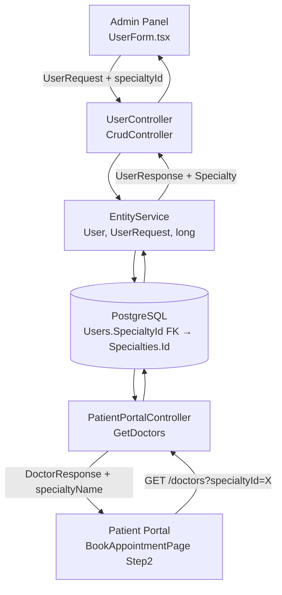
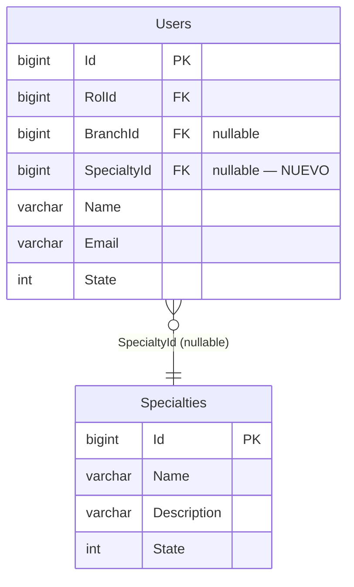

# Design Document — doctor-specialty-assignment

## Overview

La feature agrega una relación directa muchos-a-uno entre `User` (médico) y `Specialty`. Actualmente el endpoint `GET /api/v1/PatientPortal/doctors` filtra médicos a través de citas existentes (`Appointments`), lo que impide listar médicos recién creados que aún no tienen citas. La solución es agregar `SpecialtyId` nullable a la entidad `User`, exponer ese campo en los DTOs y el formulario administrativo, y reescribir el filtro del endpoint del portal del paciente para usar la nueva FK directa.

### Alcance de cambios

| Capa | Archivos modificados |
|---|---|
| Base de datos | Migración EF Core (nueva columna + FK) |
| Entidad | `User.cs` |
| Configuración EF | `UserConfiguration.cs` |
| DTOs | `UserRequest.cs`, `UserResponse.cs`, `DoctorResponse.cs` |
| Validadores | `CreateUserValidation.cs`, `UpdateUserValidation.cs`, `PartialUserValidation.cs` |
| Mapper | `MapsterConfig.cs` |
| Controlador | `PatientPortalController.cs` (método `GetDoctors`) |
| Tipos TS | `PatientPortalTypes.ts`, `UserRequest.ts` |
| Componente | `UserForm.tsx` |

---

## Architecture

El cambio sigue el patrón existente del proyecto: entidad → configuración EF → migración → DTOs → validadores → mapper → controlador. No se introduce ningún servicio nuevo ni patrón arquitectónico distinto. El `EntityService<User, UserRequest, long>` genérico ya maneja el CRUD; solo se necesita que incluya `Specialty` en sus queries.



---

## Components and Interfaces

### Backend

#### `User.cs` — Entidad de dominio

Agregar dos propiedades al final de la clase, antes del cierre:

```csharp
/// <summary>
/// Gets or sets the SpecialtyId (nullable — solo aplica a médicos)
/// </summary>
public long? SpecialtyId { get; set; }

/// <summary>
/// Gets or sets the Specialty navigation property
/// </summary>
public virtual Specialty? Specialty { get; set; }
```

#### `UserConfiguration.cs` — Configuración EF Core

Agregar dentro del método `Configure`, después de la configuración de `Branch`:

```csharp
entity.HasOne(e => e.Specialty)
    .WithMany()
    .HasForeignKey(e => e.SpecialtyId)
    .OnDelete(DeleteBehavior.Restrict)
    .IsRequired(false);
```

#### `UserRequest.cs` — DTO de entrada

Agregar la propiedad:

```csharp
/// <summary>
/// Gets or sets the SpecialtyId (nullable — solo para médicos)
/// </summary>
public long? SpecialtyId { get; set; }
```

#### `UserResponse.cs` — DTO de salida

Agregar dos propiedades:

```csharp
/// <summary>
/// Gets or sets the SpecialtyId
/// </summary>
public long? SpecialtyId { get; set; }

/// <summary>
/// Gets or sets the Specialty
/// </summary>
public virtual SpecialtyResponse? Specialty { get; set; }
```

#### `DoctorResponse.cs` — DTO del portal del paciente

Agregar la propiedad `SpecialtyName`:

```csharp
/// <summary>
/// Name of the specialty assigned to the doctor (if any).
/// </summary>
public string? SpecialtyName { get; set; }
```

La propiedad `SpecialtyId` ya existe en el DTO actual.

#### Validadores

**`CreateUserValidation.cs`** — agregar al constructor:

```csharp
When(x => x.SpecialtyId != null, () =>
{
    RuleFor(x => x.SpecialtyId)
        .GreaterThan(0).WithMessage("Debe seleccionar una especialidad válida");
});
```

**`UpdateUserValidation.cs`** — agregar al constructor (idéntico):

```csharp
When(x => x.SpecialtyId != null, () =>
{
    RuleFor(x => x.SpecialtyId)
        .GreaterThan(0).WithMessage("Debe seleccionar una especialidad válida");
});
```

**`PartialUserValidation.cs`** — agregar al constructor (idéntico):

```csharp
When(x => x.SpecialtyId != null, () =>
{
    RuleFor(x => x.SpecialtyId)
        .GreaterThan(0).WithMessage("Debe seleccionar una especialidad válida");
});
```

#### `MapsterConfig.cs` — Mapper Mapster

En el bloque `TypeAdapterConfig<UserRequest, User>.NewConfig()`, agregar:

```csharp
.Map(dest => dest.SpecialtyId, src => src.SpecialtyId)
```

En el bloque `TypeAdapterConfig<User, UserResponse>.NewConfig()`, agregar:

```csharp
.Map(dest => dest.SpecialtyId, src => src.SpecialtyId)
.Map(dest => dest.Specialty, src => src.Specialty)
```

El mapper `Specialty → SpecialtyResponse` ya existe en `MapsterConfig.cs` y será usado automáticamente por Mapster al mapear la propiedad de navegación.

#### `PatientPortalController.cs` — Método `GetDoctors`

Reemplazar la implementación completa del método:

```csharp
[AllowAnonymous]
[ExcludeFromSync]
[HttpGet("doctors")]
public async Task<IActionResult> GetDoctors([FromQuery] long specialtyId)
{
    IQueryable<User> query = _bd.Users
        .Include(u => u.Rol)
        .Include(u => u.Specialty)
        .Where(u => u.State == 1 && u.Rol != null && u.Rol.Name == "Medico");

    if (specialtyId > 0)
    {
        query = query.Where(u => u.SpecialtyId == specialtyId);
    }

    List<User> doctors = await query.ToListAsync();

    List<DoctorResponse> doctorResponses = doctors.Select(d => new DoctorResponse
    {
        Id = d.Id,
        Name = d.Name,
        SpecialtyId = d.SpecialtyId,
        SpecialtyName = d.Specialty?.Name
    }).ToList();

    return Ok(new Response<List<DoctorResponse>>
    {
        Success = true,
        Message = "Médicos obtenidos correctamente",
        Data = doctorResponses,
        TotalResults = doctorResponses.Count
    });
}
```

Los cambios clave respecto a la implementación actual:
1. Se agrega `.Include(u => u.Specialty)` para cargar la especialidad.
2. El filtro por `specialtyId` usa `u.SpecialtyId == specialtyId` en lugar del join con `Appointments`.
3. `DoctorResponse.SpecialtyId` se toma de `d.SpecialtyId` (el valor real del médico) en lugar del parámetro de query.
4. Se agrega `SpecialtyName = d.Specialty?.Name`.

### Frontend

#### `PatientPortalTypes.ts` — Tipo `DoctorResponse`

Agregar la propiedad `specialtyName`:

```typescript
export interface DoctorResponse {
  id: number;
  name: string;
  specialtyId?: number;
  specialtyName?: string;   // ← nuevo
}
```

#### `UserRequest.ts` — Tipo `UserRequest`

Agregar la propiedad `specialtyId` y la referencia al objeto `specialty`:

```typescript
export interface UserRequest {
  // ... propiedades existentes ...
  specialtyId?: number | null;       // ← nuevo
  specialty?: SpecialtyResponse | null; // ← nuevo (para pre-selección en edición)
}
```

Agregar el import necesario:

```typescript
import type { SpecialtyResponse } from "./SpecialtyResponse";
```

#### `UserForm.tsx` — Formulario administrativo

**Imports a agregar:**

```typescript
import { getSpecialties } from "../../services/specialtyService";
import type { SpecialtyResponse } from "../../types/SpecialtyResponse";
```

**Selector de especialidad** — agregar dentro del `<div className="grid ...">`, después del selector de `Sucursal` y antes del selector de `Estado`:

```tsx
const selectorSpecialty = useCallback(
  (item: SpecialtyResponse) => ({
    label: item.name,
    value: String(item.id),
  }),
  [],
);

// Dentro del JSX:
<CatalogueSelect
  defaultValue={
    type === "edit" && form.specialtyId
      ? {
          label: form.specialty?.name ?? String(form.specialtyId),
          value: String(form.specialtyId),
        }
      : null
  }
  deps="State:eq:1"
  errorMessage={errors?.specialtyId as string}
  fieldSearch="Name"
  isInvalid={!!errors?.specialtyId}
  label="Especialidad (Médicos)"
  name="specialtyId"
  placeholder="Seleccione una especialidad (opcional)"
  queryFn={getSpecialties}
  selectorFn={selectorSpecialty}
  onChange={handleSelectChange("specialtyId")}
/>
```

El `handleSelectChange` existente ya convierte el valor del selector a string y lo asigna al estado del formulario. El campo es opcional para todos los roles (no lleva `isRequired`).

#### `BookAppointmentPage.tsx` — Step2Doctor

Actualizar el renderizado de cada médico para mostrar `d.specialtyName` cuando esté disponible, usando `specialtyName` del paso anterior como fallback:

```tsx
// Dentro del map de doctors en Step2Doctor:
<div>
  <p className="font-semibold text-gray-800 dark:text-gray-100">{d.name}</p>
  <p className="text-sm text-gray-500 dark:text-gray-400">
    {d.specialtyName ?? specialtyName}
  </p>
</div>
```

El cambio es mínimo: reemplazar `{specialtyName}` por `{d.specialtyName ?? specialtyName}`. Los pasos 3 y 4 no requieren cambios.

---

## Data Models

### Esquema de base de datos

**Tabla `Users`** — nueva columna:

```sql
ALTER TABLE "Users"
ADD COLUMN "SpecialtyId" bigint NULL;

ALTER TABLE "Users"
ADD CONSTRAINT "FK_Users_Specialties_SpecialtyId"
    FOREIGN KEY ("SpecialtyId")
    REFERENCES "Specialties" ("Id")
    ON DELETE RESTRICT;

CREATE INDEX "IX_Users_SpecialtyId" ON "Users" ("SpecialtyId");
```

La columna es nullable (`NULL`), sin valor por defecto, lo que garantiza compatibilidad hacia atrás: todos los registros existentes tendrán `SpecialtyId = NULL` tras la migración.

### Migración EF Core

Nombre sugerido: `AddSpecialtyIdToUser`

Comando para generarla (ejecutar desde la raíz del proyecto backend):

```bash
dotnet ef migrations add AddSpecialtyIdToUser --project Hospital.Server
```

El contenido esperado del método `Up`:

```csharp
protected override void Up(MigrationBuilder migrationBuilder)
{
    migrationBuilder.AddColumn<long>(
        name: "SpecialtyId",
        table: "Users",
        type: "bigint",
        nullable: true);

    migrationBuilder.CreateIndex(
        name: "IX_Users_SpecialtyId",
        table: "Users",
        column: "SpecialtyId");

    migrationBuilder.AddForeignKey(
        name: "FK_Users_Specialties_SpecialtyId",
        table: "Users",
        column: "SpecialtyId",
        principalTable: "Specialties",
        principalColumn: "Id",
        onDelete: ReferentialAction.Restrict);
}
```

### Relaciones del modelo



### EntityService — Include de Specialty

El `EntityService<User, UserRequest, long>` genérico construye sus queries internamente. Para que `Specialty` se incluya en `GetAll` y `GetById`, se debe verificar si el servicio genérico soporta configuración de includes. Si el `EntityService` expone un mecanismo de includes (por ejemplo, a través de la configuración de EF o de un override), se debe agregar `Include(u => u.Specialty)`.

Si el `EntityService` no soporta includes configurables, la alternativa es sobrescribir el `UserController` para inyectar un query personalizado, o agregar la lógica de include directamente en el `DataContext` mediante query filters. La opción más simple y consistente con el patrón del proyecto es verificar si `EntityService` tiene un método virtual `GetQueryable()` que se pueda sobrescribir en un servicio derivado.

> **Decisión de diseño**: Si `EntityService` no soporta includes, se crea un `UserService` que hereda de `EntityService<User, UserRequest, long>` y sobrescribe el método de query para agregar `.Include(u => u.Specialty).Include(u => u.Rol)`. Este servicio se registra en `ServicesGroup.cs` reemplazando el registro genérico de `User`.

---

## Correctness Properties

*Una propiedad es una característica o comportamiento que debe ser verdadero en todas las ejecuciones válidas del sistema — esencialmente, una declaración formal sobre lo que el sistema debe hacer. Las propiedades sirven como puente entre especificaciones legibles por humanos y garantías de corrección verificables automáticamente.*

### Property 1: SpecialtyId inválido es rechazado por todos los validadores

*Para cualquier* `UserRequest` con `SpecialtyId` no-null y `SpecialtyId <= 0`, los tres validadores (`CreateUserValidation`, `UpdateUserValidation`, `PartialUserValidation`) deben retornar al menos un error de validación relacionado con `SpecialtyId`.

**Validates: Requirements 3.1, 3.2, 3.3**

### Property 2: SpecialtyId null siempre es válido

*Para cualquier* `UserRequest` válido en todos sus demás campos, si `SpecialtyId` es `null`, ninguno de los tres validadores debe retornar error relacionado con `SpecialtyId`.

**Validates: Requirements 1.5, 3.4**

### Property 3: Round-trip de mapeo User → UserResponse preserva Specialty

*Para cualquier* `User` con una `Specialty` asignada (no null), el mapper Mapster `User → UserResponse` debe producir un `UserResponse` donde `Specialty` no es null, `Specialty.Id == User.Specialty.Id`, y `Specialty.Name == User.Specialty.Name`.

**Validates: Requirements 2.4, 2.5**

### Property 4: Filtrado de médicos por especialidad es exacto

*Para cualquier* `specialtyId > 0`, todos los `DoctorResponse` retornados por `GetDoctors` deben tener `SpecialtyId == specialtyId`, y ningún médico con `SpecialtyId != specialtyId` debe aparecer en los resultados.

**Validates: Requirements 5.1, 5.4**

### Property 5: Sin filtro retorna todos los médicos activos

*Para cualquier* conjunto de usuarios en base de datos, llamar a `GetDoctors` sin `specialtyId` (o con `specialtyId = 0`) debe retornar exactamente todos los usuarios con `State = 1` y `Rol.Name = "Medico"`, sin importar su `SpecialtyId`.

**Validates: Requirements 5.2**

### Property 6: Médicos sin especialidad retornan campos null de forma segura

*Para cualquier* `User` con `SpecialtyId = null`, tanto el mapper `User → UserResponse` como la proyección en `GetDoctors` deben producir `Specialty = null` / `SpecialtyName = null` sin lanzar excepción.

**Validates: Requirements 7.1, 7.2**

### Property 7: El formulario incluye specialtyId en el request enviado

*Para cualquier* valor de `specialtyId` seleccionado en el `UserForm` (incluyendo null para "sin especialidad"), el `UserRequest` construido y enviado al backend debe contener exactamente ese valor en el campo `specialtyId`.

**Validates: Requirements 4.2, 4.4**

---

## Error Handling

### Backend

| Escenario | Comportamiento esperado |
|---|---|
| `SpecialtyId` enviado con valor `0` o negativo | Validador retorna `400 Bad Request` con mensaje "Debe seleccionar una especialidad válida" |
| `SpecialtyId` referencia una especialidad inexistente | EF Core lanza `DbUpdateException` por violación de FK; el controlador genérico retorna `500` o se puede capturar con middleware de errores existente |
| `SpecialtyId` referencia una especialidad con `State = 0` | No hay validación de estado en el backend (la FK solo verifica existencia). El frontend filtra por `State:eq:1` en el selector, lo que previene esta situación en condiciones normales |
| Médico con `SpecialtyId = null` consultado | `UserResponse.Specialty = null`, sin error |
| `GET /doctors?specialtyId=999` sin médicos con esa especialidad | Retorna `200 OK` con `Data = []`, `TotalResults = 0`, `Success = true` |
| Eliminación de una `Specialty` referenciada por un `User` | `OnDelete(DeleteBehavior.Restrict)` previene la eliminación; EF Core retorna error de FK |

### Frontend

| Escenario | Comportamiento esperado |
|---|---|
| Error al cargar especialidades en `UserForm` | `CatalogueSelect` muestra "No hay opciones disponibles" (comportamiento estándar del componente) |
| `specialtyId` inválido enviado al backend | El `useForm` hook captura el error de validación del backend y lo muestra en el campo correspondiente |
| `Step2Doctor` sin médicos para la especialidad seleccionada | Mensaje existente: "No hay médicos disponibles para esta especialidad." |

---

## Testing Strategy

### Enfoque dual

Se combinan tests de ejemplo (unitarios) para casos concretos y tests basados en propiedades para verificar invariantes universales.

### Librería de property-based testing

Para el backend (.NET 8): **FsCheck** (versión `2.x` o `3.x`) con integración xUnit via `FsCheck.Xunit`.

```xml
<!-- Hospital.Server.Tests/Hospital.Server.Tests.csproj -->
<PackageReference Include="FsCheck.Xunit" Version="2.16.6" />
<PackageReference Include="xunit" Version="2.9.0" />
<PackageReference Include="FluentAssertions" Version="6.12.0" />
```

Para el frontend (React + TypeScript): **fast-check** con Vitest.

```bash
npm install --save-dev fast-check
```

### Tests de propiedades (mínimo 100 iteraciones cada uno)

Cada test debe incluir un comentario de tag en el formato:
`// Feature: doctor-specialty-assignment, Property {N}: {texto}`

#### Property 1 — SpecialtyId inválido rechazado

```csharp
// Feature: doctor-specialty-assignment, Property 1: SpecialtyId inválido es rechazado por todos los validadores
[Property]
public Property SpecialtyId_NonPositive_FailsAllValidators()
{
    var arb = Arb.Generate<long>()
        .Where(x => x <= 0)
        .ToArbitrary();

    return Prop.ForAll(arb, invalidId =>
    {
        var request = new UserRequest { SpecialtyId = invalidId };
        var createValidator = new CreateUserValidation();
        var updateValidator = new UpdateUserValidation();
        var partialValidator = new PartialUserValidation();

        var createResult = createValidator.Validate(request);
        var updateResult = updateValidator.Validate(request);
        var partialResult = partialValidator.Validate(request);

        return createResult.Errors.Any(e => e.PropertyName == "SpecialtyId")
            && updateResult.Errors.Any(e => e.PropertyName == "SpecialtyId")
            && partialResult.Errors.Any(e => e.PropertyName == "SpecialtyId");
    });
}
```

#### Property 2 — SpecialtyId null siempre válido

```csharp
// Feature: doctor-specialty-assignment, Property 2: SpecialtyId null siempre es válido
[Property]
public Property SpecialtyId_Null_PassesAllValidators()
{
    // Generar requests con todos los campos requeridos válidos y SpecialtyId = null
    return Prop.ForAll(ValidUserRequestArb(), request =>
    {
        request.SpecialtyId = null;
        var createValidator = new CreateUserValidation();
        var updateValidator = new UpdateUserValidation();
        var partialValidator = new PartialUserValidation();

        var createResult = createValidator.Validate(request);
        var updateResult = updateValidator.Validate(request);
        var partialResult = partialValidator.Validate(request);

        return !createResult.Errors.Any(e => e.PropertyName == "SpecialtyId")
            && !updateResult.Errors.Any(e => e.PropertyName == "SpecialtyId")
            && !partialResult.Errors.Any(e => e.PropertyName == "SpecialtyId");
    });
}
```

#### Property 3 — Round-trip mapper User → UserResponse

```csharp
// Feature: doctor-specialty-assignment, Property 3: Round-trip de mapeo User → UserResponse preserva Specialty
[Property]
public Property Mapper_User_To_UserResponse_PreservesSpecialty()
{
    return Prop.ForAll(UserWithSpecialtyArb(), user =>
    {
        var config = TypeAdapterConfig.GlobalSettings;
        MapsterConfig.RegisterMappings();
        var response = user.Adapt<UserResponse>(config);

        return response.Specialty != null
            && response.Specialty.Id == user.Specialty!.Id
            && response.Specialty.Name == user.Specialty.Name
            && response.SpecialtyId == user.SpecialtyId;
    });
}
```

#### Property 4 — Filtrado exacto por especialidad

```csharp
// Feature: doctor-specialty-assignment, Property 4: Filtrado de médicos por especialidad es exacto
[Property]
public Property GetDoctors_WithSpecialtyId_ReturnsOnlyMatchingDoctors()
{
    return Prop.ForAll(DoctorListWithSpecialtiesArb(), tuple =>
    {
        var (doctors, targetSpecialtyId) = tuple;
        // Simular la lógica de filtrado del controlador
        var filtered = doctors
            .Where(d => d.State == 1 && d.Rol?.Name == "Medico" && d.SpecialtyId == targetSpecialtyId)
            .ToList();

        return filtered.All(d => d.SpecialtyId == targetSpecialtyId)
            && doctors.Where(d => d.SpecialtyId != targetSpecialtyId)
                      .All(d => !filtered.Contains(d));
    });
}
```

#### Property 5 — Sin filtro retorna todos los médicos activos

```csharp
// Feature: doctor-specialty-assignment, Property 5: Sin filtro retorna todos los médicos activos
[Property]
public Property GetDoctors_WithoutFilter_ReturnsAllActiveDoctors()
{
    return Prop.ForAll(DoctorListArb(), doctors =>
    {
        var activeDoctors = doctors
            .Where(d => d.State == 1 && d.Rol?.Name == "Medico")
            .ToList();

        // La lógica del controlador sin filtro debe retornar exactamente estos
        var result = doctors
            .Where(d => d.State == 1 && d.Rol != null && d.Rol.Name == "Medico")
            .ToList();

        return result.Count == activeDoctors.Count
            && activeDoctors.All(d => result.Contains(d));
    });
}
```

#### Property 6 — Médicos sin especialidad retornan null de forma segura

```csharp
// Feature: doctor-specialty-assignment, Property 6: Médicos sin especialidad retornan campos null de forma segura
[Property]
public Property Mapper_UserWithNullSpecialty_ReturnsNullSpecialtyWithoutException()
{
    return Prop.ForAll(UserWithNullSpecialtyArb(), user =>
    {
        MapsterConfig.RegisterMappings();
        UserResponse? response = null;
        Exception? ex = null;
        try { response = user.Adapt<UserResponse>(); }
        catch (Exception e) { ex = e; }

        return ex == null && response != null && response.Specialty == null;
    });
}
```

#### Property 7 — Frontend: formulario incluye specialtyId en el request (fast-check)

```typescript
// Feature: doctor-specialty-assignment, Property 7: El formulario incluye specialtyId en el request enviado
import * as fc from "fast-check";

test("UserForm incluye specialtyId en el request para cualquier valor seleccionado", () => {
  fc.assert(
    fc.property(
      fc.option(fc.integer({ min: 1, max: 9999 }), { nil: null }),
      (specialtyId) => {
        // Simular el handleSelectChange con el valor generado
        const form: UserRequest = { specialtyId };
        expect(form.specialtyId).toBe(specialtyId);
      }
    ),
    { numRuns: 100 }
  );
});
```

### Tests de ejemplo (unitarios)

- **Migración**: verificar que la migración `AddSpecialtyIdToUser` existe y contiene `AddColumn<long>("SpecialtyId", nullable: true)`.
- **Endpoint sin médicos**: `GET /doctors?specialtyId=9999` retorna `200 OK` con `Data = []` y `TotalResults = 0`.
- **Endpoint sin filtro**: médico sin citas pero con `SpecialtyId` asignado aparece en `GET /doctors`.
- **UserForm modo edición**: renderizar con `initialForm.specialtyId = 3` y verificar que el `CatalogueSelect` de especialidad muestra el valor pre-seleccionado.
- **Step2Doctor**: renderizar con médico que tiene `specialtyName = "Cardiología"` y verificar que se muestra ese texto.

### Tests de integración

- Crear un `User` con `SpecialtyId` válido via `POST /api/v1/User` y verificar que `GET /api/v1/User/{id}` retorna `Specialty` con los datos correctos.
- Verificar que eliminar una `Specialty` referenciada por un `User` retorna error (FK Restrict).
- Flujo completo del wizard: seleccionar especialidad → listar médicos con esa especialidad → confirmar cita.
