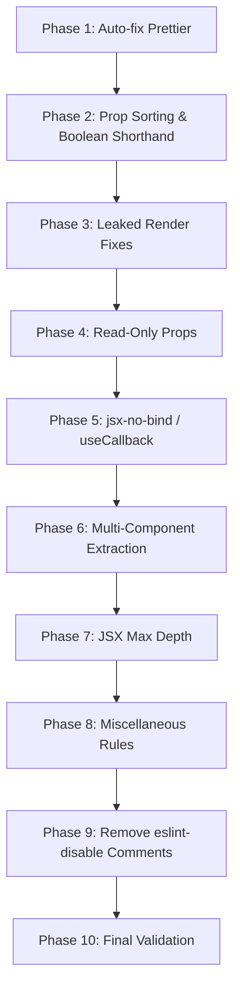

# Design Document: ESLint Compliance Refactor

## Overview

This design describes the systematic approach to eliminate all 4,390 ESLint problems (4,088 errors, 302 warnings) across ~200 source files in the `hospital.client` React frontend. The refactoring is organized into phases ordered by automation potential and dependency: auto-fixable formatting first, then mechanical rule fixes, then structural refactors requiring manual intervention.

The strategy prioritizes **safe, incremental changes** — each phase produces a buildable, functional codebase. No behavioral changes are introduced; every transformation preserves existing component contracts, prop interfaces, and runtime behavior.

### Key Design Decisions

1. **Prettier first**: The 3,430 `prettier/prettier` violations are auto-fixable via `eslint --fix`. Running this first eliminates ~78% of all problems and produces clean diffs for subsequent manual changes.

2. **Bottom-up extraction**: When splitting multi-component files, extract leaf/helper components first (e.g., `StatusBadge`, `DetailRow`) before touching the parent page component. This avoids circular dependencies and keeps imports clean.

3. **`useCallback` over component extraction for handlers**: For `jsx-no-bind`, prefer wrapping handlers in `useCallback` within the same component. Only extract to a child component when the handler is parameterized per list item (e.g., `onClick={() => onSelect(item)}`).

4. **No new abstractions**: The refactoring does not introduce new patterns, libraries, or architectural changes. It applies the minimum transformation needed to satisfy each ESLint rule.

## Architecture

The refactoring does not change the application architecture. The existing structure remains:

```
hospital.client/src/
├── components/       # Reusable UI components (badge, button, form, grid, etc.)
├── configs/          # Axios config, constants
├── containers/       # Layout shells (Layout, LayoutLogin, PortalLayout, Root)
├── data/             # Static data (cie10.json)
├── hooks/            # Custom React hooks
├── pages/            # Route-level page components
├── routes/           # React Router configuration and middleware
├── services/         # API service functions (Axios calls)
├── stores/           # Zustand stores
├── types/            # TypeScript type definitions
├── utils/            # Utility functions
└── validations/      # Zod/custom validation schemas
```

### Refactoring Phases



**Phase 1 — Auto-fix Prettier (~3,430 errors):** Run `npx eslint . --fix` to resolve all `prettier/prettier` violations. This is fully automated and safe.

**Phase 2 — Prop Sorting & Boolean Shorthand (~253 warnings + ~10 errors):** Run `eslint --fix` for `react/jsx-sort-props` (auto-fixable) and manually fix `react/jsx-boolean-value`. These are cosmetic changes with no behavioral impact.

**Phase 3 — Leaked Render Fixes (~142 errors):** Replace `{value && <Component />}` patterns with `{!!value && <Component />}` or ternary expressions. Mechanical find-and-replace with manual verification.

**Phase 4 — Read-Only Props (~72 errors):** Add `readonly` modifier to all prop interface properties. Mechanical transformation with no runtime effect.

**Phase 5 — jsx-no-bind / useCallback (~235 errors):** Replace inline arrow functions in JSX props with `useCallback`-wrapped handlers. This is the most labor-intensive phase and requires understanding each component's closure dependencies.

**Phase 6 — Multi-Component Extraction (~55 errors):** Split files containing multiple component definitions. Key files:
- `CreateAppointmentPage.tsx` (8 components → 8 files)
- `BookAppointmentPage.tsx` (6 components → 6 files)
- `PortalPage.tsx` (4 components → 4 files)
- `PrescriptionDetailPage.tsx` (4 components → 4 files)
- `PatientDashboardPage.tsx`, `MyAppointmentsPage.tsx`, `DoctorDashboardPage.tsx`, `NurseDashboardPage.tsx`, `AdminDashboardPage.tsx` (2-3 components each)
- `DoctorCalendarPage.tsx` (utility functions + component)
- `AppointmentViewPage.tsx` (2 components)

**Phase 7 — JSX Max Depth (~39 warnings):** Extract deeply nested JSX subtrees into child components. Primarily affects `Sidebar.tsx` (which has an `eslint-disable` comment) and complex form/page components.

**Phase 8 — Miscellaneous Rules:** Fix remaining violations:
- `react/no-unescaped-entities`: Escape special characters in JSX text
- `react-hooks/exhaustive-deps`: Fix dependency arrays (3 files with eslint-disable comments)
- `react-refresh/only-export-components`: Separate component and non-component exports
- `react/button-has-type`: Add explicit `type` attribute to `<button>` elements
- `react/jsx-no-useless-fragment`: Remove unnecessary `<></>` wrappers
- `@typescript-eslint/no-unused-vars`: Remove or prefix unused variables
- `react-hooks/rules-of-hooks`: Ensure hooks are called at top level only

**Phase 9 — Remove eslint-disable Comments:** Remove all 4 known `eslint-disable` comments after the underlying code has been fixed:
- `hospital.client/src/components/layout/Sidebar.tsx` (`react/jsx-max-depth`)
- `hospital.client/src/components/portal/ReservationTimer.tsx` (`react-hooks/exhaustive-deps`)
- `hospital.client/src/pages/rol/RolOperationPage.tsx` (`react-hooks/exhaustive-deps`)
- `hospital.client/src/hooks/useAppointmentHub.ts` (`react-hooks/exhaustive-deps`)

**Phase 10 — Final Validation:** Run `npm run lint` (zero errors, zero warnings) and `npm run build` (zero TypeScript errors) to confirm full compliance.

## Components and Interfaces

### Extracted Component Naming Convention

When extracting components from multi-component files, the following conventions apply:

| Source File | Extracted Component | Target Location |
|---|---|---|
| `pages/appointment/CreateAppointmentPage.tsx` | `StepIndicator` | `components/shared/StepIndicator.tsx` |
| `pages/appointment/CreateAppointmentPage.tsx` | `Step1Patient`, `Step2Branch`, etc. | `pages/appointment/steps/Step1Patient.tsx`, etc. |
| `pages/appointment/AppointmentViewPage.tsx` | `DetailRow` | `components/pure/DetailRow.tsx` |
| `pages/portal/BookAppointmentPage.tsx` | `StepIndicator` (reuse above), step components | `pages/portal/steps/Step1Branch.tsx`, etc. |
| `pages/portal/PortalPage.tsx` | `HeroSection`, `SpecialtyCard`, `BranchCard`, `DpiVerificationModal` | `pages/portal/components/HeroSection.tsx`, etc. |
| `pages/portal/MyAppointmentsPage.tsx` | `StatusBadge`, `AppointmentRow` | `pages/portal/components/StatusBadge.tsx`, etc. |
| `pages/portal/PatientDashboardPage.tsx` | `StatusBadge` (reuse above), `AppointmentCard` | `pages/portal/components/AppointmentCard.tsx` |
| `pages/portal/PortalPaymentPage.tsx` | `PortalPaymentContent` | `pages/portal/components/PortalPaymentContent.tsx` |
| `pages/portal/PortalRegisterPage.tsx` | `Field` | `components/pure/FormField.tsx` |
| `pages/portal/ProfilePage.tsx` | `Field` (reuse above) | Reuse `FormField.tsx` |
| `pages/prescription/PrescriptionDetailPage.tsx` | `AddItemForm`, `CreatePrescriptionGuard`, `CreatePrescriptionForm`, `ExistingPrescriptionView` | `pages/prescription/components/*.tsx` |
| `pages/medical-consultation/CreateMedicalConsultationPage.tsx` | `CreateMedicalConsultationGuard` | `pages/medical-consultation/components/CreateMedicalConsultationGuard.tsx` |
| `pages/dashboard/DoctorDashboardPage.tsx` | `AppointmentCard` | `pages/dashboard/components/DoctorAppointmentCard.tsx` |
| `pages/dashboard/NurseDashboardPage.tsx` | `AppointmentCard` | `pages/dashboard/components/NurseAppointmentCard.tsx` |
| `pages/dashboard/AdminDashboardPage.tsx` | `StatCard`, `QuickActionButton` | `pages/dashboard/components/StatCard.tsx`, `QuickActionButton.tsx` |
| `pages/vital-sign/CreateVitalSignPage.tsx` | `CreateVitalSignGuard` | `pages/vital-sign/components/CreateVitalSignGuard.tsx` |
| `pages/doctor-calendar/DoctorCalendarPage.tsx` | Utility functions | `utils/calendarUtils.ts` |
| `hooks/useAuthorizationRoutes.tsx` | `RootIndex` | `routes/RootIndex.tsx` |

### Handler Refactoring Patterns

**Pattern A — Simple handler extraction:**
```tsx
// Before (jsx-no-bind violation)
<Button onClick={() => setOpen(true)}>Open</Button>

// After
const handleOpen = useCallback(() => setOpen(true), []);
<Button onClick={handleOpen}>Open</Button>
```

**Pattern B — Curried handler refactoring (used in forms):**
```tsx
// Before (jsx-no-bind violation via curried function)
const handleTextChange = useCallback(
  (name: string) => (val: string) => { ... },
  [handleChange],
);
<TextField onChange={handleTextChange("userName")} />

// After — extract stable per-field handlers
const handleUserNameChange = useCallback(
  (val: string) => {
    handleChange({ target: { name: "userName", value: val } } as ...);
  },
  [handleChange],
);
<TextField onChange={handleUserNameChange} />
```

**Pattern C — List item handler extraction:**
```tsx
// Before (jsx-no-bind violation in list)
{items.map(item => (
  <Card onClick={() => onSelect(item)} />
))}

// After — extract child component
function SelectableCard({ item, onSelect }: Props) {
  const handleClick = useCallback(() => onSelect(item), [item, onSelect]);
  return <Card onClick={handleClick} />;
}
```

### Leaked Render Fix Patterns

```tsx
// Before (jsx-no-leaked-render)
{count && <Badge count={count} />}
{items.length && <List items={items} />}
{errorMessage && <Alert message={errorMessage} />}

// After — boolean coercion
{!!count && <Badge count={count} />}
{items.length > 0 && <List items={items} />}
{!!errorMessage && <Alert message={errorMessage} />}

// Or ternary
{count ? <Badge count={count} /> : null}
```

### Read-Only Props Pattern

```tsx
// Before
interface CardProps {
  title: string;
  onClick: () => void;
}

// After
interface CardProps {
  readonly title: string;
  readonly onClick: () => void;
}
```

## Data Models

No data model changes. This refactoring is purely structural and cosmetic — it modifies how components are organized, formatted, and typed, but does not alter any data structures, API contracts, state shapes, or type definitions beyond adding `readonly` modifiers to prop interfaces.

### Files Affected Summary

| Category | Estimated Files | Primary Rule |
|---|---|---|
| Prettier formatting | ~200 | `prettier/prettier` |
| Prop sorting | ~80 | `react/jsx-sort-props` |
| Leaked renders | ~50 | `react/jsx-no-leaked-render` |
| Read-only props | ~40 | `react/prefer-read-only-props` |
| Inline handlers | ~60 | `react/jsx-no-bind` |
| Multi-component | ~15 | `react/no-multi-comp` |
| JSX max depth | ~10 | `react/jsx-max-depth` |
| Miscellaneous | ~30 | Various |
| eslint-disable removal | 4 | N/A |

## Error Handling

### Refactoring Safety

1. **No behavioral changes**: Every transformation is semantically equivalent. `useCallback` wrapping preserves callback identity across renders but does not change what the callback does. Prop reordering has no runtime effect. `readonly` is a compile-time-only modifier.

2. **Import integrity**: When extracting components to new files, all import paths must be updated in every consuming file. The approach is:
   - Extract component to new file with all its dependencies
   - Update the original file to import from the new location
   - Search for any other files importing the extracted component and update them
   - Run TypeScript compilation to catch any missed imports

3. **Dependency array correctness**: When fixing `react-hooks/exhaustive-deps`, the approach is:
   - Add missing dependencies to the array when safe (most cases)
   - If adding a dependency would cause an infinite loop, restructure the hook logic (e.g., use `useRef` for values that shouldn't trigger re-runs)
   - Never suppress the warning with `eslint-disable` — the underlying issue must be resolved

4. **Build verification**: After each phase, run `tsc -b` to verify no TypeScript errors were introduced. Run `npm run build` after the final phase for full validation.

### Risk Mitigation

| Risk | Mitigation |
|---|---|
| `useCallback` with wrong deps causes stale closures | Include all referenced variables in dependency arrays; verify with `exhaustive-deps` rule |
| Component extraction breaks lazy loading | Keep `Component` re-exports in page files per React Router convention (Requirement 3.5) |
| Prettier auto-fix conflicts with other rules | Run Prettier fix first, then address remaining rules on the formatted code |
| `readonly` modifier breaks existing spread patterns | TypeScript `readonly` on interfaces does not affect runtime spread; compile check catches issues |

## Testing Strategy

### Verification Approach

This refactoring is verified through **static analysis and build validation**, not through property-based testing or new unit tests. The acceptance criteria are binary: ESLint reports zero problems, and the build succeeds.

**Why PBT does not apply:** This feature is a code refactoring task — reformatting files, reorganizing components, replacing inline handlers with `useCallback`, and adding type modifiers. There are no new functions with input/output behavior to test. The "test" is the ESLint linter itself, which already encodes the rules as formal specifications. Running `npm run lint` with zero errors is the definitive verification.

### Verification Steps

1. **Per-phase lint check**: After each refactoring phase, run `npx eslint . --format json` and verify the targeted rule's error count drops to zero.

2. **TypeScript compilation**: Run `tsc -b` after each phase to catch type errors introduced by refactoring (especially after component extraction and `readonly` additions).

3. **Final full validation**:
   ```bash
   npm run lint    # Must report 0 errors, 0 warnings
   npm run build   # Must complete with 0 TypeScript errors
   ```

4. **Manual smoke test**: After the full refactoring, verify the application loads and key flows work (login, navigation, form submission) to catch any runtime regressions from `useCallback` dependency issues or broken imports.

### What Could Go Wrong

- **Stale closures from `useCallback`**: If a dependency is missed, a handler may capture an outdated value. The `exhaustive-deps` rule catches this — running lint after Phase 5 validates correctness.
- **Broken imports after extraction**: TypeScript compilation catches missing or incorrect imports immediately.
- **Prettier conflicts**: Running Prettier first ensures all subsequent changes are on consistently formatted code, avoiding merge conflicts between rules.
