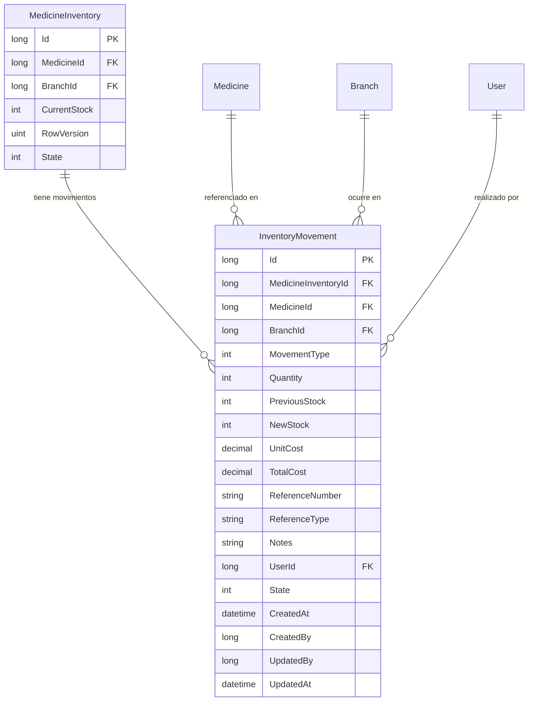

# Documento de Diseño Técnico — Cuentas, Órdenes e Inventario (HIS)

## Resumen General

Este documento describe el diseño técnico para las mejoras al Sistema de Información Hospitalaria (HIS) en tres áreas: gestión de cuentas de usuario, cálculo de precios en órdenes médicas y gestión de inventario de farmacia.

El diseño se alinea con la arquitectura existente del proyecto: backend ASP.NET Core 8 con patrón `EntityService<TEntity, TRequest, TId>` + `CrudController`, validación con FluentValidation, mapeo con Mapster, y frontend React 19 + TypeScript + Vite + HeroUI + TailwindCSS.

Se organiza en tres áreas funcionales:

- **Área 1 — Cuentas de Usuario (Requisitos 1–6):** Recuperación de contraseña, perfil del paciente, toggle de visibilidad, cambio manual de contraseña, plantillas de correo y limpieza del login.
- **Área 2 — Precios y Pagos (Requisitos 7–9):** Cálculo automático de precios en órdenes de laboratorio y despachos de farmacia, integración de órdenes pendientes en caja.
- **Área 3 — Inventario de Farmacia (Requisitos 10–11):** Bitácora de movimientos de inventario y operaciones CRUD de reabastecimiento.

---

## Arquitectura

### Diagrama de Arquitectura General

```mermaid
graph TB
    subgraph Frontend["Frontend (React 19 + TypeScript)"]
        LP[LoginPage]
        PP[ProfilePage - Portal]
        CPP[ChangePasswordPage]
        LOP[LabOrderPage]
        DP[DispensePage]
        PAY[PaymentPage + Órdenes Pendientes]
        MIP[MedicineInventoryPage + Bitácora]
        PVT[PasswordVisibilityToggle]
    end

    subgraph Backend["Backend (ASP.NET Core 8)"]
        AC[AuthController]
        UC[UserController]
        LOC[LabOrderController]
        DC[DispenseController]
        PC[PaymentController]
        MIC[MedicineInventoryController]
        IMC[InventoryMovementController]
        
        AS[AuthService]
        SE[SendEmail + Plantillas]
        ES[EntityService genérico]
        IMS[InventoryMovementService]
        
        INT_LO[LabOrderBeforeCreateInterceptor]
        INT_DI[DispenseBeforeCreateInterceptor]
        INT_IM[InventoryMovementBeforeCreateInterceptor]
    end

    subgraph Database["PostgreSQL"]
        U[(User)]
        LO[(LabOrder)]
        LOI[(LabOrderItem)]
        LE[(LabExam)]
        DI[(Dispense)]
        DII[(DispenseItem)]
        ME[(Medicine)]
        MI[(MedicineInventory)]
        IM[(InventoryMovement)]
        PA[(Payment)]
    end

    LP --> AC
    PP --> UC
    CPP --> AC
    LOP --> LOC
    DP --> DC
    PAY --> PC
    PAY --> LOC
    PAY --> DC
    MIP --> MIC
    MIP --> IMC

    AC --> AS
    AS --> SE
    LOC --> ES
    LOC --> INT_LO
    DC --> ES
    DC --> INT_DI
    IMC --> IMS
    IMS --> INT_IM

    ES --> LO
    ES --> LOI
    ES --> DI
    ES --> DII
    ES --> MI
    IMS --> IM
    IMS --> MI
    INT_LO --> LE
    INT_DI --> ME
```



### Decisiones Arquitectónicas

1. **Reutilización del patrón EntityService + CrudController:** La nueva entidad `InventoryMovement` seguirá el mismo patrón CRUD genérico existente. Sin embargo, necesitará un interceptor `IEntityBeforeCreateInterceptor` para la lógica de negocio de actualización de stock.

2. **Interceptores para cálculo de precios:** Se usarán `IEntityBeforeCreateInterceptor` existentes (o se crearán nuevos) para:
   - Copiar `LabExam.DefaultAmount` → `LabOrderItem.Amount` al crear ítems de orden.
   - Copiar `Medicine.DefaultPrice` → `DispenseItem.UnitPrice` al crear ítems de despacho.
   - Recalcular `TotalAmount` en el servidor al crear/actualizar órdenes y despachos.

3. **Servicio de correo con plantillas:** Se extenderá `ISendMail` con un nuevo método que acepte un tipo de plantilla y datos dinámicos, manteniendo retrocompatibilidad con el método `Send` existente.

4. **Componente reutilizable PasswordVisibilityToggle:** Se creará como componente React independiente que envuelve cualquier campo `<Input>` de contraseña, con auto-revert a tipo "password" después de 10 segundos.

5. **Bloqueo optimista para inventario:** Se mantiene el uso de `RowVersion` (xmin de PostgreSQL) en `MedicineInventory` para prevenir condiciones de carrera en actualizaciones concurrentes de stock.

6. **Endpoint personalizado para órdenes pendientes:** Se agregará un endpoint `GET /api/v1/Payment/PendingOrders?dpi={dpi}` en `PaymentController` para consultar órdenes pendientes de pago por DPI del paciente.

---

## Componentes e Interfaces

### Área 1 — Cuentas de Usuario

#### 1.1 Mejoras al AuthService (Requisitos 1, 4)

**Cambios en `IAuthService`:**
```csharp
// Nuevo método para cambio manual de contraseña (usuario autenticado)
Response<string, List<ValidationFailure>> ManualChangePassword(ManualChangePasswordRequest model);
```

**Nuevo DTO `ManualChangePasswordRequest`:**
```csharp
public class ManualChangePasswordRequest
{
    public long UserId { get; set; }           // Inyectado desde JWT
    public string CurrentPassword { get; set; } // Contraseña actual
    public string NewPassword { get; set; }     // Nueva contraseña (min 12 chars)
    public string ConfirmPassword { get; set; } // Confirmación
}
```

**Mejoras al flujo `RecoveryPassword`:**
- Cambiar la respuesta cuando el correo no existe: retornar éxito genérico (prevenir enumeración de cuentas — Req 1.4).
- Validar vigencia del token (15 minutos) en `ChangePassword`.
- Validar mínimo 12 caracteres y diferencia con contraseña anterior en `ChangePassword`.
- Limpiar `RecoveryToken`, establecer `Reset=false` y registrar `UpdatedAt` tras cambio exitoso.

**Nuevo endpoint en `AuthController`:**
```csharp
[Authorize]
[HttpPost("ManualChangePassword")]
public ActionResult ManualChangePassword([FromBody] ManualChangePasswordRequest model)
```

#### 1.2 Servicio de Correo con Plantillas (Requisito 5)

**Extensión de `ISendMail`:**
```csharp
public interface ISendMail
{
    bool Send(string correo, string asunto, string mensaje);
    // Nuevo método con plantillas
    bool SendWithTemplate(string correo, string asunto, EmailTemplateType templateType, Dictionary<string, string> data);
}
```

**Enum `EmailTemplateType`:**
```csharp
public enum EmailTemplateType
{
    PasswordRecovery = 0,
    PasswordChangeConfirmation = 1,
    AppointmentConfirmation = 2,
    PaymentConfirmation = 3
}
```

**Clase `EmailTemplateService`:**
- Carga plantillas HTML desde archivos embebidos o strings constantes.
- Reemplaza placeholders `{{NombreUsuario}}`, `{{EnlaceRecuperacion}}`, `{{FechaHora}}`, etc.
- Usa CSS inline y tablas para compatibilidad con Gmail, Outlook, Yahoo.
- Incluye encabezado con logo HIS, pie de página con datos de contacto y aviso de no-responder.

#### 1.3 Perfil del Paciente (Requisito 2)

**Frontend — Nueva página `ProfilePage.tsx`:**
- Ruta: `/portal/profile`
- Muestra datos del usuario autenticado: nombre, email, teléfono, DPI (solo lectura), NIT, número de seguro.
- Formulario con validación Zod: nombre (10–100 chars), teléfono (8 dígitos), email válido.
- Envía `PATCH /api/v1/User` con solo los campos modificados.
- DPI (`IdentificationDocument`) se renderiza como campo `isReadOnly`.

**No requiere cambios en backend:** El endpoint `PATCH /api/v1/User` ya existe y soporta actualización parcial.

#### 1.4 Toggle de Visibilidad de Contraseña (Requisito 3)

**Nuevo componente `PasswordVisibilityToggle.tsx`:**
```typescript
interface PasswordToggleProps {
  value: string;
  onChange: (val: string) => void;
  name: string;
  label: string;
  isInvalid?: boolean;
  errorMessage?: string;
}
```

- Alterna `type` entre "password" y "text".
- Icono de ojo abierto (oculto) / ojo tachado (visible).
- Auto-revert a "password" después de 10 segundos de inactividad (useEffect con timer).
- Se integra en: LoginForm, formulario de login del portal, registro, recuperación, cambio de contraseña y perfil.

#### 1.5 Limpieza del LoginForm (Requisito 6)

**Cambios en `LoginForm.tsx`:**
- Eliminar el enlace "No tienes cuenta? Registrate".
- Eliminar el enlace "Ver Portal de Servicios".
- Mantener solo: campos de usuario/contraseña, botón "Iniciar Sesión" y enlace "¿Olvidó su contraseña?".
- Integrar `PasswordVisibilityToggle` en el campo de contraseña.

---

### Área 2 — Precios y Pagos de Órdenes

#### 2.1 Cálculo de Precios en Órdenes de Laboratorio (Requisito 7)

**Backend — Interceptor `LabOrderItemBeforeCreateInterceptor`:**
```csharp
public class LabOrderItemBeforeCreateInterceptor : IEntityBeforeCreateInterceptor<LabOrderItem, LabOrderItemRequest>
{
    // 1. Buscar LabExam por LabExamId
    // 2. Copiar LabExam.DefaultAmount → LabOrderItem.Amount
    // 3. Copiar LabExam.Name → LabOrderItem.ExamName
}
```

**Backend — Interceptor `LabOrderAfterCreateInterceptor` (mejorar existente):**
- Después de crear una LabOrder con Items, recalcular `TotalAmount = SUM(Items.Amount)` donde `State=1`.
- Ignorar cualquier `TotalAmount` enviado por el frontend.

**Frontend — Mejoras en `LabOrderForm.tsx`:**
- Al seleccionar un LabExam, mostrar su `DefaultAmount` como precio.
- Mostrar tabla con: nombre del examen, precio individual, y total acumulado en tiempo real.
- Si `DefaultAmount` es 0 o nulo, mostrar advertencia "Precio no configurado".
- Formato de moneda: `Q {monto}` con 2 decimales.

#### 2.2 Cálculo de Precios en Despachos de Farmacia (Requisito 9)

**Backend — Interceptor `DispenseItemBeforeCreateInterceptor`:**
```csharp
public class DispenseItemBeforeCreateInterceptor : IEntityBeforeCreateInterceptor<DispenseItem, DispenseItemRequest>
{
    // 1. Buscar Medicine por MedicineId
    // 2. Copiar Medicine.DefaultPrice → DispenseItem.UnitPrice
}
```

**Backend — Interceptor para Dispense (mejorar existente):**
- Recalcular `TotalAmount = SUM(Items.UnitPrice × Items.Quantity)` donde `State=1`.
- Ignorar cualquier `TotalAmount` enviado por el frontend.

**Frontend — Mejoras en `DispenseForm.tsx`:**
- Al seleccionar un Medicine, mostrar su `DefaultPrice` como precio unitario.
- Mostrar tabla con: nombre, cantidad, precio unitario, subtotal por línea, total acumulado.
- Recalcular en tiempo real al cambiar cantidad.
- Si `DefaultPrice` es 0 o nulo, mostrar advertencia "Precio no configurado".

#### 2.3 Órdenes Pendientes en Módulo de Caja (Requisito 8)

**Backend — Nuevo endpoint en `PaymentController`:**
```csharp
[HttpGet("PendingOrders")]
public ActionResult GetPendingOrders([FromQuery] string? dpi, [FromQuery] string? orderNumber)
{
    // 1. Buscar paciente por DPI (IdentificationDocument)
    // 2. Consultar LabOrders con OrderStatus=0 del paciente
    // 3. Consultar Dispenses con DispenseStatus=0 del paciente
    // 4. Retornar lista consolidada de PendingOrderResponse
}
```

**Nuevo DTO `PendingOrderResponse`:**
```csharp
public class PendingOrderResponse
{
    public string OrderType { get; set; }       // "LabOrder" o "Dispense"
    public long OrderId { get; set; }
    public string OrderNumber { get; set; }
    public string PatientName { get; set; }
    public string PatientDpi { get; set; }
    public DateTime CreatedAt { get; set; }
    public int ItemCount { get; set; }
    public decimal TotalAmount { get; set; }
    public int PaymentType { get; set; }        // 1=Laboratorio, 2=Farmacia
}
```

**Frontend — Mejoras en `PaymentPage.tsx`:**
- Agregar sección "Órdenes Pendientes de Pago" arriba de la tabla de pagos.
- Campo de búsqueda por DPI o número de orden.
- Tabla de resultados con: tipo, número de orden, paciente, fecha, cantidad de ítems, total, botón "Cobrar".
- Al hacer clic en "Cobrar", abrir modal/formulario de pago prellenado con monto, tipo de pago y referencia.
- Tras pago exitoso, actualizar estado de la orden vía `PATCH`.
- Generar `IdempotencyKey` (UUID v4) por cada transacción.
- Soporte para selección múltiple cuando un paciente tiene varias órdenes pendientes.

---

### Área 3 — Inventario de Farmacia

#### 3.1 Nueva Entidad InventoryMovement (Requisito 10)

**Entidad `InventoryMovement`:**
```csharp
public class InventoryMovement : IEntity<long>
{
    public long Id { get; set; }
    public long MedicineInventoryId { get; set; }
    public long MedicineId { get; set; }
    public long BranchId { get; set; }
    public int MovementType { get; set; }       // Enum: 0-6
    public int Quantity { get; set; }
    public int PreviousStock { get; set; }
    public int NewStock { get; set; }
    public decimal UnitCost { get; set; }
    public decimal TotalCost { get; set; }
    public string? ReferenceNumber { get; set; }
    public string? ReferenceType { get; set; }
    public string? Notes { get; set; }
    public long UserId { get; set; }
    // Campos de auditoría estándar
    public int State { get; set; } = 1;
    public DateTime CreatedAt { get; set; }
    public long CreatedBy { get; set; }
    public long? UpdatedBy { get; set; }
    public DateTime? UpdatedAt { get; set; }
    // Navegación
    public virtual MedicineInventory? MedicineInventory { get; set; }
    public virtual Medicine? Medicine { get; set; }
    public virtual Branch? Branch { get; set; }
    public virtual User? User { get; set; }
}
```

**Enum `MovementType`:**
| Valor | Nombre              | Tipo    |
|-------|---------------------|---------|
| 0     | Compra              | Entrada |
| 1     | Devolución_Proveedor| Entrada |
| 2     | Venta               | Salida  |
| 3     | Reclamo             | Salida  |
| 4     | Ajuste_Positivo     | Entrada |
| 5     | Ajuste_Negativo     | Salida  |
| 6     | Despacho            | Salida  |

**Patrón CRUD completo:**
- `InventoryMovementRequest` (IRequest<long?>)
- `InventoryMovementResponse`
- `CreateInventoryMovementValidation`, `UpdateInventoryMovementValidation`, `PartialInventoryMovementValidation`
- Mappers en `MapsterConfig.cs`
- Registro en `ServicesGroup.cs` y `ValidationsGroup.cs`
- Configuración de entidad en `Context/Configurations/InventoryMovementConfiguration.cs`

#### 3.2 Controlador InventoryMovementController (Requisito 10)

```csharp
[ModuleInfo(
    DisplayName = "Bitácora de Inventario",
    Description = "Gestión de movimientos de inventario de farmacia",
    Icon = "bi-journal-text",
    Path = "inventory-movement",
    Order = 16,
    IsVisible = true
)]
[Route("api/v1/[controller]")]
public class InventoryMovementController : CrudController<InventoryMovement, InventoryMovementRequest, InventoryMovementResponse, long>
```

#### 3.3 Interceptor de Movimientos de Inventario

**`InventoryMovementBeforeCreateInterceptor`:**
```
1. Obtener MedicineInventory por MedicineInventoryId
2. Registrar PreviousStock = MedicineInventory.CurrentStock
3. Si es entrada (Compra, Devolución, Ajuste_Positivo):
   - NewStock = PreviousStock + Quantity
4. Si es salida (Venta, Reclamo, Ajuste_Negativo, Despacho):
   - Validar que PreviousStock >= Quantity (sino rechazar: "Stock insuficiente")
   - NewStock = PreviousStock - Quantity
5. Actualizar MedicineInventory.CurrentStock = NewStock
6. Calcular TotalCost = UnitCost × Quantity
7. Usar bloqueo optimista (RowVersion) al guardar MedicineInventory
```

#### 3.4 Movimiento Automático por Despacho (Requisito 10.8)

**`DispenseAfterStatusChangeInterceptor`:**
- Cuando un Dispense cambia a `DispenseStatus=2` (Dispensed), crear automáticamente un `InventoryMovement` de tipo `Despacho` (6) por cada `DispenseItem`, decrementando el stock correspondiente.

#### 3.5 Frontend — Bitácora de Movimientos

**Nueva sección en `MedicineInventoryPage.tsx`:**
- Tab o sección "Bitácora de Movimientos" debajo de la tabla de inventario.
- Tabla con filtros por: medicamento, sucursal, tipo de movimiento, rango de fechas, usuario.
- Columnas: fecha/hora, tipo (badge de color), medicamento, sucursal, cantidad, stock anterior, stock nuevo, costo, referencia, usuario.
- Badges de color por tipo: Compra=verde, Venta=azul, Reclamo=rojo, Ajuste=amarillo, Despacho=morado.

#### 3.6 Frontend — Formularios de Operaciones CRUD (Requisito 11)

**Nuevo componente `InventoryMovementForm.tsx`:**
- Selector de tipo de operación (Compra, Devolución, Venta, Reclamo, Ajuste+, Ajuste-).
- Campos dinámicos según tipo:
  - Compra: medicamento, sucursal, cantidad, costo unitario, número de factura, notas.
  - Devolución: medicamento, sucursal, cantidad, referencia, motivo (notas).
  - Venta: medicamento, sucursal, cantidad, referencia.
  - Reclamo: medicamento, sucursal, cantidad, referencia, motivo (notas).
  - Ajustes: medicamento, sucursal, cantidad, justificación obligatoria (min 10 chars en Notes).
- Validación: cantidad > 0 (entero), costo unitario > 0 (decimal, 2 decimales) para compras.
- Alerta visual si stock cae por debajo de `Medicine.MinimumStock` tras operación de salida.

**Resumen por medicamento en vista de inventario:**
- Stock actual, stock mínimo, total entradas del mes, total salidas del mes, último movimiento.

---

## Modelos de Datos

### Nueva Entidad: InventoryMovement



### Configuración de Entidad (EF Core)

**`InventoryMovementConfiguration.cs`** en `Context/Configurations/`:
```csharp
public class InventoryMovementConfiguration : IEntityTypeConfiguration<InventoryMovement>
{
    public void Configure(EntityTypeBuilder<InventoryMovement> builder)
    {
        builder.ToTable("InventoryMovements");
        builder.HasKey(e => e.Id);
        builder.Property(e => e.Quantity).IsRequired();
        builder.Property(e => e.PreviousStock).IsRequired();
        builder.Property(e => e.NewStock).IsRequired();
        builder.Property(e => e.UnitCost).HasPrecision(10, 2);
        builder.Property(e => e.TotalCost).HasPrecision(10, 2);
        builder.Property(e => e.ReferenceNumber).HasMaxLength(100);
        builder.Property(e => e.ReferenceType).HasMaxLength(50);
        builder.Property(e => e.Notes).HasMaxLength(500);
        
        builder.HasOne(e => e.MedicineInventory)
            .WithMany()
            .HasForeignKey(e => e.MedicineInventoryId);
        builder.HasOne(e => e.Medicine)
            .WithMany()
            .HasForeignKey(e => e.MedicineId);
        builder.HasOne(e => e.Branch)
            .WithMany()
            .HasForeignKey(e => e.BranchId);
        builder.HasOne(e => e.User)
            .WithMany()
            .HasForeignKey(e => e.UserId);
    }
}
```

### DTOs Nuevos

**`InventoryMovementRequest`:**
```csharp
public class InventoryMovementRequest : IRequest<long?>
{
    public long? Id { get; set; }
    public long? MedicineInventoryId { get; set; }
    public long? MedicineId { get; set; }
    public long? BranchId { get; set; }
    public int? MovementType { get; set; }
    public int? Quantity { get; set; }
    public int? PreviousStock { get; set; }
    public int? NewStock { get; set; }
    public decimal? UnitCost { get; set; }
    public decimal? TotalCost { get; set; }
    public string? ReferenceNumber { get; set; }
    public string? ReferenceType { get; set; }
    public string? Notes { get; set; }
    public long? UserId { get; set; }
    public int? State { get; set; }
    public long? CreatedBy { get; set; }
    public long? UpdatedBy { get; set; }
}
```

**`InventoryMovementResponse`:**
```csharp
public class InventoryMovementResponse
{
    public long Id { get; set; }
    public long MedicineInventoryId { get; set; }
    public long MedicineId { get; set; }
    public long BranchId { get; set; }
    public int MovementType { get; set; }
    public int Quantity { get; set; }
    public int PreviousStock { get; set; }
    public int NewStock { get; set; }
    public decimal UnitCost { get; set; }
    public decimal TotalCost { get; set; }
    public string? ReferenceNumber { get; set; }
    public string? ReferenceType { get; set; }
    public string? Notes { get; set; }
    public long UserId { get; set; }
    public int State { get; set; }
    public string CreatedAt { get; set; } = string.Empty;
    public long CreatedBy { get; set; }
    public long? UpdatedBy { get; set; }
    public string? UpdatedAt { get; set; }
}
```

**`PendingOrderResponse`:**
```csharp
public class PendingOrderResponse
{
    public string OrderType { get; set; } = string.Empty;
    public long OrderId { get; set; }
    public string OrderNumber { get; set; } = string.Empty;
    public string PatientName { get; set; } = string.Empty;
    public string PatientDpi { get; set; } = string.Empty;
    public string CreatedAt { get; set; } = string.Empty;
    public int ItemCount { get; set; }
    public decimal TotalAmount { get; set; }
    public int PaymentType { get; set; }
}
```

**`ManualChangePasswordRequest`:**
```csharp
public class ManualChangePasswordRequest
{
    public long UserId { get; set; }
    public string CurrentPassword { get; set; } = string.Empty;
    public string NewPassword { get; set; } = string.Empty;
    public string ConfirmPassword { get; set; } = string.Empty;
}
```

### Resumen de Cambios en Entidades Existentes

| Entidad | Cambio | Detalle |
|---------|--------|---------|
| `LabOrderItem` | Sin cambios de esquema | El campo `Amount` ya existe; se poblará automáticamente desde `LabExam.DefaultAmount` vía interceptor |
| `LabOrder` | Sin cambios de esquema | `TotalAmount` ya existe; se recalculará en servidor |
| `DispenseItem` | Sin cambios de esquema | `UnitPrice` ya existe; se poblará desde `Medicine.DefaultPrice` vía interceptor |
| `Dispense` | Sin cambios de esquema | `TotalAmount` ya existe; se recalculará en servidor |
| `User` | Sin cambios de esquema | `RecoveryToken`, `DateToken`, `Reset`, `LastPasswordChange` ya existen |
| `Payment` | Sin cambios de esquema | `LabOrderId`, `DispenseId`, `IdempotencyKey` ya existen |

