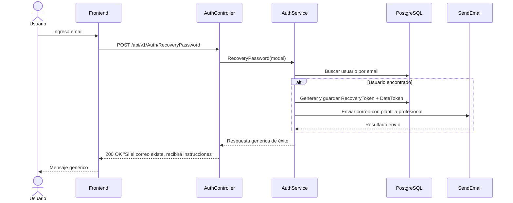
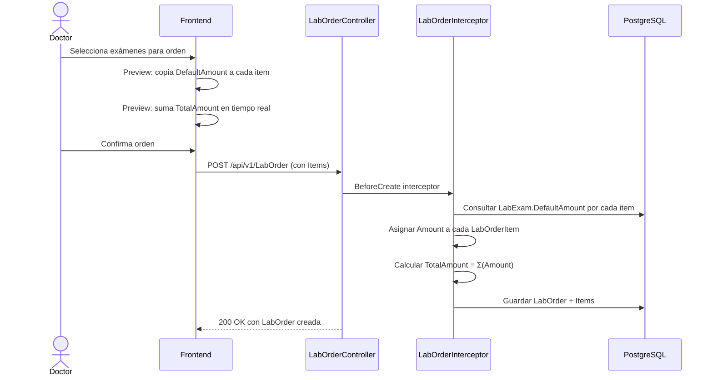
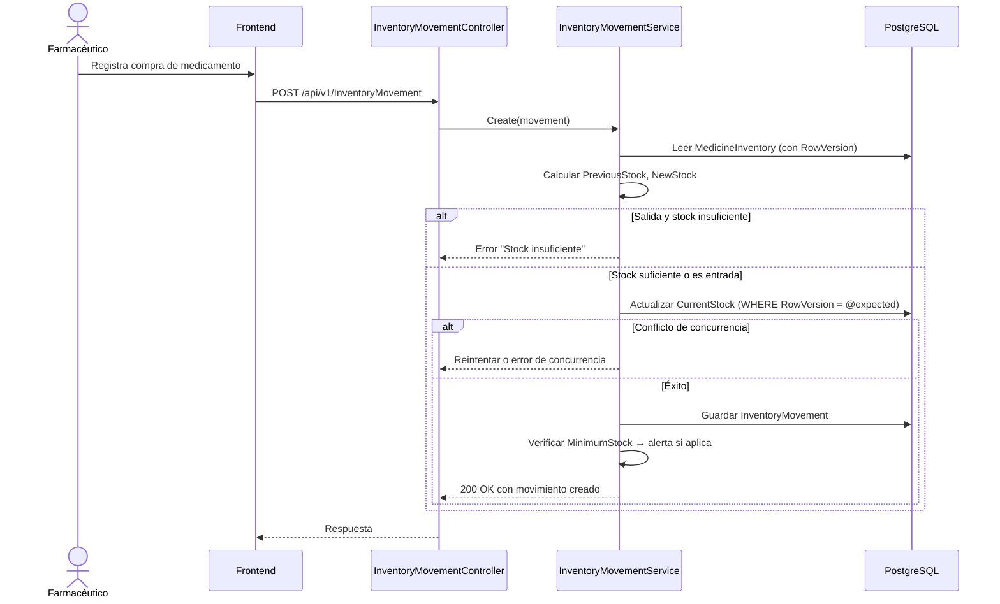
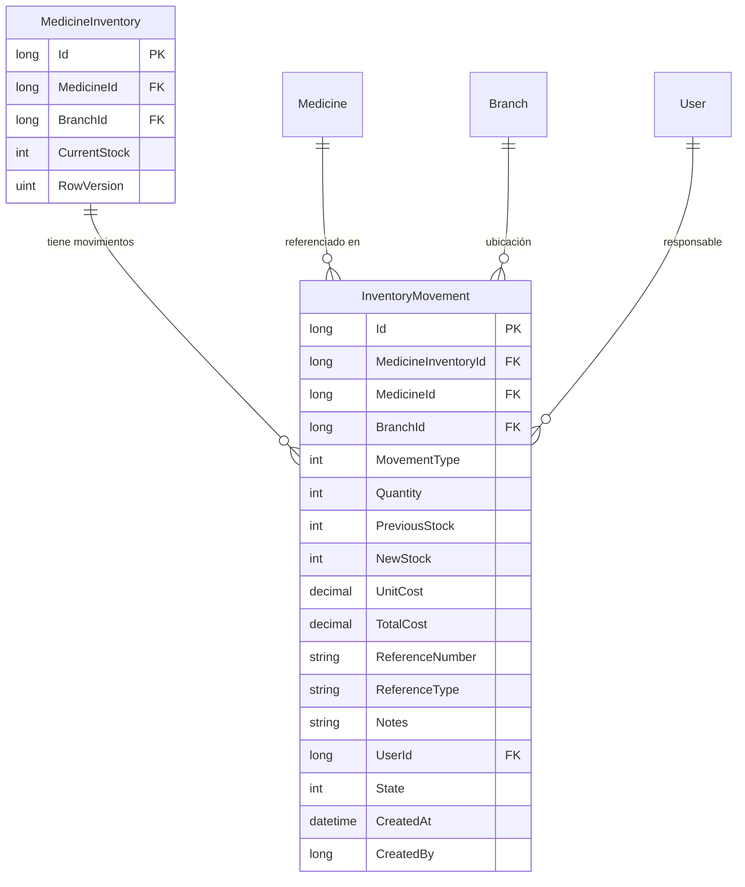

# Documento de Diseño — Cuentas, Órdenes e Inventario (HIS)

## Visión General

Este documento describe el diseño técnico para las mejoras al Sistema de Información Hospitalaria (HIS) en tres áreas: gestión de cuentas de usuario, cálculo de precios en órdenes médicas y gestión de inventario de farmacia.

El diseño se divide en tres bloques funcionales:

1. **Cuentas de Usuario (Requisitos 1–6):** Mejoras al flujo de autenticación existente — recuperación de contraseña con respuesta genérica anti-enumeración, perfil de paciente en el portal, toggle de visibilidad de contraseña como componente reutilizable, cambio manual de contraseña para usuarios autenticados, plantillas HTML profesionales para correos transaccionales y limpieza del LoginForm administrativo.

2. **Precios y Pagos de Órdenes (Requisitos 7–9):** Cálculo automático de precios en órdenes de laboratorio (copiando `LabExam.DefaultAmount` a `LabOrderItem.Amount` y sumando en `LabOrder.TotalAmount`), cálculo de precios en despachos de farmacia (copiando `Medicine.DefaultPrice` a `DispenseItem.UnitPrice` y sumando `UnitPrice × Quantity` en `Dispense.TotalAmount`), e integración de órdenes pendientes en el módulo de caja.

3. **Inventario de Farmacia (Requisitos 10–11):** Nueva entidad `InventoryMovement` para bitácora de movimientos, operaciones CRUD de reabastecimiento con actualización atómica de stock usando bloqueo optimista (`RowVersion/xmin`), y alertas de stock bajo.

### Decisiones de Diseño Clave

| Decisión | Justificación |
|----------|---------------|
| Respuesta genérica en recuperación de contraseña | Previene enumeración de cuentas (OWASP) |
| Cálculo de TotalAmount en servidor | El backend es la fuente de verdad; el frontend muestra un preview pero el servidor recalcula |
| Toggle de visibilidad como componente reutilizable | Evita duplicación de lógica en 6+ formularios |
| Plantillas de correo con CSS inline | Compatibilidad con Gmail, Outlook, Yahoo |
| InventoryMovement como entidad separada | Trazabilidad completa de auditoría sin modificar MedicineInventory |
| Bloqueo optimista para stock | Previene condiciones de carrera en actualizaciones concurrentes de inventario |
| Nuevo endpoint `POST /api/v1/Auth/ManualChangePassword` | Separa el flujo de cambio manual (requiere contraseña actual) del flujo por token de recuperación |

---

## Arquitectura

### Diagrama de Componentes

```mermaid
graph TB
    subgraph Frontend["Frontend (React 19 + TypeScript)"]
        LF[LoginForm Limpio]
        PP[Portal Paciente - Perfil]
        PTV[PasswordToggle Componente]
        CP[Cambio Contraseña]
        LOV[LabOrder Vista Precios]
        DV[Dispense Vista Precios]
        CJ[Caja - Órdenes Pendientes]
        INV[Inventario - Bitácora]
        CRUD_INV[Inventario - CRUD Movimientos]
    end

    subgraph Backend["Backend (ASP.NET Core 8)"]
        AC[AuthController]
        AS[AuthService]
        SE[SendEmail + Plantillas]
        LOC[LabOrderController]
        LOS[LabOrder Service/Interceptor]
        DC[DispenseController]
        DS[Dispense Service/Interceptor]
        PC[PaymentController]
        IMC[InventoryMovementController]
        IMS[InventoryMovementService]
    end

    subgraph Database["PostgreSQL"]
        UT[Users]
        LO[LabOrders]
        LOI[LabOrderItems]
        LE[LabExams]
        DI[Dispenses]
        DIT[DispenseItems]
        ME[Medicines]
        MI[MedicineInventory]
        IM[InventoryMovements]
        PAY[Payments]
    end

    LF --> AC
    PP --> AC
    CP --> AC
    AC --> AS
    AS --> SE
    AS --> UT

    LOV --> LOC
    LOC --> LOS
    LOS --> LO
    LOS --> LOI
    LOS --> LE

    DV --> DC
    DC --> DS
    DS --> DI
    DS --> DIT
    DS --> ME

    CJ --> PC
    CJ --> LOC
    CJ --> DC
    PC --> PAY

    INV --> IMC
    CRUD_INV --> IMC
    IMC --> IMS
    IMS --> IM
    IMS --> MI
```



### Flujo de Recuperación de Contraseña



### Flujo de Cálculo de Precios (LabOrder)



### Flujo de Movimiento de Inventario



---

## Componentes e Interfaces

### Área 1: Cuentas de Usuario

#### Backend

**AuthService — Modificaciones:**

| Método | Cambio | Descripción |
|--------|--------|-------------|
| `RecoveryPassword` | Modificar | Retornar respuesta genérica siempre (sin revelar si el email existe). Usar plantilla HTML profesional para el correo. |
| `ChangePassword` | Sin cambios | Ya funciona con token de recuperación. |
| `ManualChangePassword` (nuevo) | Crear | Nuevo método que recibe `currentPassword`, `newPassword`, `confirmPassword`. Valida contraseña actual con BCrypt, aplica reglas de nueva contraseña (≥12 chars, diferente a actual), actualiza `LastPasswordChange`. |

**AuthController — Modificaciones:**

| Endpoint | Método HTTP | Cambio |
|----------|-------------|--------|
| `POST /api/v1/Auth/ManualChangePassword` | POST | Nuevo endpoint `[Authorize]`. Recibe `ManualChangePasswordRequest`. Obtiene `UserId` del JWT. |

**Nuevos DTOs:**

```csharp
// ManualChangePasswordRequest
public class ManualChangePasswordRequest
{
    public string CurrentPassword { get; set; }
    public string NewPassword { get; set; }
    public string ConfirmNewPassword { get; set; }
}
```

**SendEmail — Modificaciones:**

| Método | Cambio | Descripción |
|--------|--------|-------------|
| `Send` | Sin cambios en firma | Se mantiene `Send(correo, asunto, mensaje)` |
| `SendWithTemplate` (nuevo) | Crear | Nuevo método que recibe tipo de plantilla + diccionario de datos dinámicos. Carga plantilla HTML, reemplaza placeholders, llama a `Send`. |

**Interfaz ISendMail — Extensión:**

```csharp
public interface ISendMail
{
    bool Send(string correo, string asunto, string mensaje);
    bool SendWithTemplate(string correo, string asunto, EmailTemplateType templateType, Dictionary<string, string> data);
}
```

**EmailTemplateType (enum):**

```csharp
public enum EmailTemplateType
{
    PasswordRecovery = 0,
    PasswordChangeConfirmation = 1,
    AppointmentConfirmation = 2,
    PaymentConfirmation = 3
}
```

**Plantillas HTML:** Se almacenarán como archivos `.html` embebidos en `Hospital.Server/Templates/Email/` con placeholders `{{NombreUsuario}}`, `{{EnlaceRecuperacion}}`, `{{FechaHora}}`, etc. CSS inline para compatibilidad con clientes de correo.

#### Frontend

**PasswordToggleInput (nuevo componente reutilizable):**

```typescript
interface PasswordToggleInputProps {
  name: string;
  label: string;
  value: string;
  onChange: (val: string) => void;
  isInvalid?: boolean;
  errorMessage?: string;
  autoHideSeconds?: number; // default: 10
}
```

- Alterna `type` entre `"password"` y `"text"`
- Icono: ojo abierto (oculto) / ojo tachado (visible)
- Auto-revert a `"password"` después de 10 segundos de inactividad
- Basado en componentes HeroUI (`Input`, `TextField`)

**LoginForm — Modificaciones:**
- Reemplazar campo de contraseña con `PasswordToggleInput`
- Eliminar enlace "No tienes cuenta? Registrate"
- Eliminar enlace "Ver Portal de Servicios"
- Mantener solo: campos usuario/contraseña, botón login, enlace "¿Olvidó su contraseña?"

**ProfilePage (nueva página portal):**
- Ruta: `/portal/profile`
- Muestra datos del paciente autenticado
- DPI como campo de solo lectura
- Campos editables: nombre, email, teléfono, NIT, número de seguro
- Validación Zod en frontend
- Envía `PATCH /api/v1/User` con campos modificados

**ManualChangePasswordForm (nuevo componente):**
- Tres campos: contraseña actual, nueva contraseña, confirmar nueva contraseña
- Todos con `PasswordToggleInput`
- Validación: nueva contraseña ≥ 12 caracteres, confirmación coincide
- Accesible desde perfil del portal y menú del panel administrativo

---

### Área 2: Precios y Pagos de Órdenes

#### Backend

**LabOrder — Interceptor de Precios (nuevo):**

Se creará un `IEntityBeforeCreateInterceptor<LabOrder, LabOrderRequest>` que:
1. Para cada `LabOrderItem` en la orden, consulta `LabExam.DefaultAmount` y lo asigna a `LabOrderItem.Amount`
2. Calcula `LabOrder.TotalAmount = Σ(LabOrderItem.Amount)` donde `State=1`
3. Ignora cualquier `TotalAmount` enviado por el frontend

Se creará un `IEntityBeforeUpdateInterceptor<LabOrder, LabOrderRequest>` con la misma lógica de recálculo.

**Dispense — Interceptor de Precios (nuevo):**

Se creará un `IEntityBeforeCreateInterceptor<Dispense, DispenseRequest>` que:
1. Para cada `DispenseItem`, consulta `Medicine.DefaultPrice` y lo asigna a `DispenseItem.UnitPrice`
2. Calcula `Dispense.TotalAmount = Σ(DispenseItem.UnitPrice × DispenseItem.Quantity)` donde `State=1`
3. Ignora cualquier `TotalAmount` enviado por el frontend

Se creará un `IEntityBeforeUpdateInterceptor<Dispense, DispenseRequest>` con la misma lógica.

**Nota:** Si ya existen interceptores `LabOrderBeforeCreateInterceptor` y `DispenseAfterCreateInterceptor` (como se ve en `ServicesGroup.cs`), la lógica de precios se integrará en los interceptores existentes en lugar de crear nuevos.

#### Frontend

**LabOrderForm — Modificaciones:**
- Al seleccionar un `LabExam`, copiar `DefaultAmount` al campo `Amount` del item (preview)
- Mostrar precio individual por examen y total acumulado en tiempo real
- Si `DefaultAmount` es 0 o nulo, mostrar badge "Precio no configurado"
- Formato moneda: `Q {monto.toFixed(2)}`

**DispenseForm — Modificaciones:**
- Al seleccionar un `Medicine`, copiar `DefaultPrice` al campo `UnitPrice` del item
- Mostrar: nombre, cantidad, precio unitario, subtotal por línea, total del despacho
- Recalcular en tiempo real al cambiar cantidad
- Si `DefaultPrice` es 0 o nulo, mostrar badge "Precio no configurado"

**PaymentPage — Sección Órdenes Pendientes (nueva):**
- Búsqueda por DPI del paciente o número de orden
- Consulta `GET /api/v1/LabOrder?Filters=OrderStatus:eq:0,PatientId:eq:{id}&Include=Patient,Items`
- Consulta `GET /api/v1/Dispense?Filters=DispenseStatus:eq:0,PatientId:eq:{id}&Include=Patient,Items`
- Tabla con: tipo (Lab/Farmacia), número, paciente, fecha, cantidad items, total, botón "Cobrar"
- Al cobrar: abre formulario de pago prellenado con monto, tipo y referencia
- Tras pago exitoso: `PATCH` para actualizar estado de la orden
- Genera `IdempotencyKey` (UUID v4) por transacción

---

### Área 3: Inventario de Farmacia

#### Backend

**InventoryMovement (nueva entidad):**

Sigue el patrón `IEntity<long>` del proyecto. Campos detallados en la sección de Modelos de Datos.

**InventoryMovementController (nuevo):**

```csharp
[ModuleInfo(
    DisplayName = "Movimientos de Inventario",
    Description = "Bitácora de entradas y salidas de medicamentos",
    Icon = "bi-arrow-left-right",
    Path = "InventoryMovement",
    Order = 16,
    IsVisible = true
)]
[Route("api/v1/[controller]")]
public class InventoryMovementController : CrudController<InventoryMovement, InventoryMovementRequest, InventoryMovementResponse, long>
```

**InventoryMovementService (servicio personalizado):**

No se usará el `EntityService` genérico directamente para la creación, ya que se necesita lógica de negocio adicional:
1. Leer `MedicineInventory.CurrentStock` con `RowVersion`
2. Validar stock suficiente para salidas
3. Calcular `PreviousStock` y `NewStock`
4. Actualizar `MedicineInventory.CurrentStock` con bloqueo optimista
5. Crear el registro `InventoryMovement`
6. Todo dentro de una transacción

Se implementará como un servicio que hereda de `EntityService<InventoryMovement, InventoryMovementRequest, long>` y sobrescribe el método `Create` para agregar la lógica de actualización de stock.

Alternativamente, se puede usar un `IEntityBeforeCreateInterceptor<InventoryMovement, InventoryMovementRequest>` para inyectar la lógica de stock antes de la creación.

**Decisión:** Usar un interceptor `IEntityBeforeCreateInterceptor` para mantener consistencia con el patrón existente del proyecto. El interceptor:
- Lee el `MedicineInventory` correspondiente
- Valida stock para salidas
- Asigna `PreviousStock` y `NewStock` al movimiento
- Actualiza `MedicineInventory.CurrentStock`
- Usa `RowVersion` para bloqueo optimista

**Despacho automático (Requisito 10.8):**

Cuando un `Dispense` cambia a estado `Dispensed` (DispenseStatus=2), se creará automáticamente un `InventoryMovement` de tipo `Despacho` (MovementType=6) por cada `DispenseItem`. Esto se implementará en el interceptor `DispenseAfterUpdateInterceptor`.

#### Frontend

**InventoryMovementPage (nueva página):**
- Tabla de bitácora con columnas: fecha, tipo (badge color), medicamento, sucursal, cantidad, stock anterior, stock nuevo, costo, referencia, usuario
- Filtros: medicamento, sucursal, tipo de movimiento, rango de fechas, usuario
- Paginación estándar

**InventoryMovementForm (nuevo formulario):**
- Campos dinámicos según tipo de movimiento:
  - Compra: medicamento, sucursal, cantidad, costo unitario, número de factura, notas
  - Devolución: medicamento, sucursal, cantidad, referencia, motivo (notas)
  - Venta: medicamento, sucursal, cantidad, referencia
  - Reclamo: medicamento, sucursal, cantidad, referencia, motivo (notas)
  - Ajuste (+/-): medicamento, sucursal, cantidad, justificación obligatoria (≥10 chars)
- Validación Zod

**MedicineInventory Vista — Resumen (modificación):**
- Agregar a la vista de inventario por medicamento: stock actual, stock mínimo, entradas del mes, salidas del mes, último movimiento

---

## Modelos de Datos

### Entidades Existentes — Modificaciones

No se requieren cambios en las entidades existentes de base de datos. Las entidades `User`, `LabOrder`, `LabOrderItem`, `LabExam`, `Dispense`, `DispenseItem`, `Medicine`, `MedicineInventory` y `Payment` ya tienen todos los campos necesarios.

Los cambios son de **lógica de negocio** (interceptores, servicios) y **frontend** (nuevas vistas, componentes).

### Nueva Entidad: InventoryMovement

```csharp
public class InventoryMovement : IEntity<long>
{
    public long Id { get; set; }

    // Referencias
    public long MedicineInventoryId { get; set; }  // FK a MedicineInventory
    public long MedicineId { get; set; }            // FK a Medicine (desnormalizado para consultas)
    public long BranchId { get; set; }              // FK a Branch (desnormalizado para consultas)

    // Tipo de movimiento
    // 0=Compra, 1=Devolución_Proveedor, 2=Venta, 3=Reclamo,
    // 4=Ajuste_Positivo, 5=Ajuste_Negativo, 6=Despacho
    public int MovementType { get; set; }

    // Cantidades
    public int Quantity { get; set; }               // Siempre positivo
    public int PreviousStock { get; set; }          // Stock antes del movimiento
    public int NewStock { get; set; }               // Stock después del movimiento

    // Costos
    public decimal UnitCost { get; set; }           // Costo unitario (precision 10,2)
    public decimal TotalCost { get; set; }          // Costo total (precision 10,2)

    // Referencias documentales
    public string? ReferenceNumber { get; set; }    // Número de factura, orden, etc.
    public string? ReferenceType { get; set; }      // "Factura", "OrdenCompra", "Despacho", "Reclamo"
    public string? Notes { get; set; }              // Observaciones

    // Usuario responsable
    public long UserId { get; set; }                // FK a User

    // Auditoría estándar
    public int State { get; set; } = 1;
    public DateTime CreatedAt { get; set; }
    public long CreatedBy { get; set; }
    public long? UpdatedBy { get; set; }
    public DateTime? UpdatedAt { get; set; }

    // Navegación
    public virtual MedicineInventory? MedicineInventory { get; set; }
    public virtual Medicine? Medicine { get; set; }
    public virtual Branch? Branch { get; set; }
    public virtual User? User { get; set; }
}
```

### Configuración de Entidad (EF Core)

```csharp
// Hospital.Server/Context/Config/InventoryMovementConfiguration.cs
public class InventoryMovementConfiguration : IEntityTypeConfiguration<InventoryMovement>
{
    public void Configure(EntityTypeBuilder<InventoryMovement> entity)
    {
        entity.ToTable("InventoryMovements");
        entity.HasKey(e => e.Id);

        entity.Property(e => e.Quantity).IsRequired();
        entity.Property(e => e.PreviousStock).IsRequired();
        entity.Property(e => e.NewStock).IsRequired();
        entity.Property(e => e.MovementType).IsRequired();
        entity.Property(e => e.UnitCost).HasPrecision(10, 2);
        entity.Property(e => e.TotalCost).HasPrecision(10, 2);
        entity.Property(e => e.ReferenceNumber).HasMaxLength(100);
        entity.Property(e => e.ReferenceType).HasMaxLength(50);
        entity.Property(e => e.Notes).HasMaxLength(1000);

        entity.HasOne(e => e.MedicineInventory)
              .WithMany()
              .HasForeignKey(e => e.MedicineInventoryId)
              .OnDelete(DeleteBehavior.Restrict);

        entity.HasOne(e => e.Medicine)
              .WithMany()
              .HasForeignKey(e => e.MedicineId)
              .OnDelete(DeleteBehavior.Restrict);

        entity.HasOne(e => e.Branch)
              .WithMany()
              .HasForeignKey(e => e.BranchId)
              .OnDelete(DeleteBehavior.Restrict);

        entity.HasOne(e => e.User)
              .WithMany()
              .HasForeignKey(e => e.UserId)
              .OnDelete(DeleteBehavior.Restrict);
    }
}
```

### DTOs Nuevos

**InventoryMovementRequest:**

```csharp
public class InventoryMovementRequest : IRequest<long>
{
    public long? Id { get; set; }
    public long? MedicineInventoryId { get; set; }
    public long? MedicineId { get; set; }
    public long? BranchId { get; set; }
    public int? MovementType { get; set; }
    public int? Quantity { get; set; }
    public int? PreviousStock { get; set; }
    public int? NewStock { get; set; }
    public decimal? UnitCost { get; set; }
    public decimal? TotalCost { get; set; }
    public string? ReferenceNumber { get; set; }
    public string? ReferenceType { get; set; }
    public string? Notes { get; set; }
    public long? UserId { get; set; }
    public int? State { get; set; }
    public long? CreatedBy { get; set; }
    public long? UpdatedBy { get; set; }
}
```

**InventoryMovementResponse:**

```csharp
public class InventoryMovementResponse
{
    public long Id { get; set; }
    public long MedicineInventoryId { get; set; }
    public long MedicineId { get; set; }
    public long BranchId { get; set; }
    public int MovementType { get; set; }
    public int Quantity { get; set; }
    public int PreviousStock { get; set; }
    public int NewStock { get; set; }
    public decimal UnitCost { get; set; }
    public decimal TotalCost { get; set; }
    public string? ReferenceNumber { get; set; }
    public string? ReferenceType { get; set; }
    public string? Notes { get; set; }
    public long UserId { get; set; }
    public int State { get; set; }
    public DateTime CreatedAt { get; set; }
    public long CreatedBy { get; set; }
    public long? UpdatedBy { get; set; }
    public DateTime? UpdatedAt { get; set; }

    // Navegación aplanada
    public string? MedicineName { get; set; }
    public string? BranchName { get; set; }
    public string? UserName { get; set; }
}
```

**ManualChangePasswordRequest:**

```csharp
public class ManualChangePasswordRequest
{
    public string CurrentPassword { get; set; } = string.Empty;
    public string NewPassword { get; set; } = string.Empty;
    public string ConfirmNewPassword { get; set; } = string.Empty;
}
```

### Diagrama Entidad-Relación (Nuevas Relaciones)



