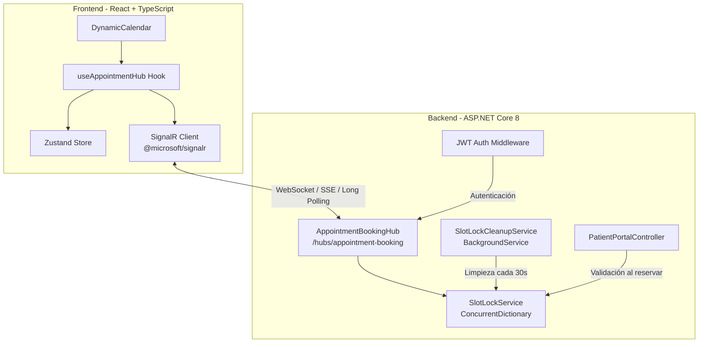
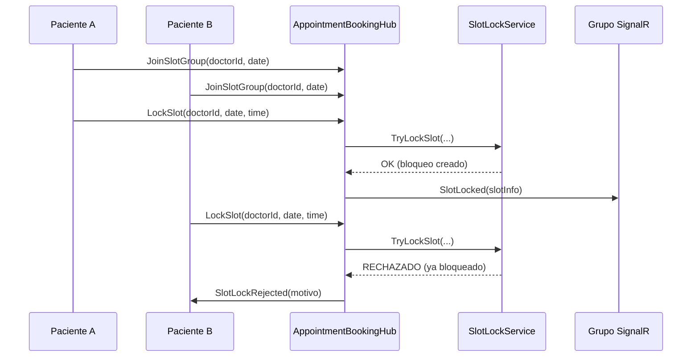
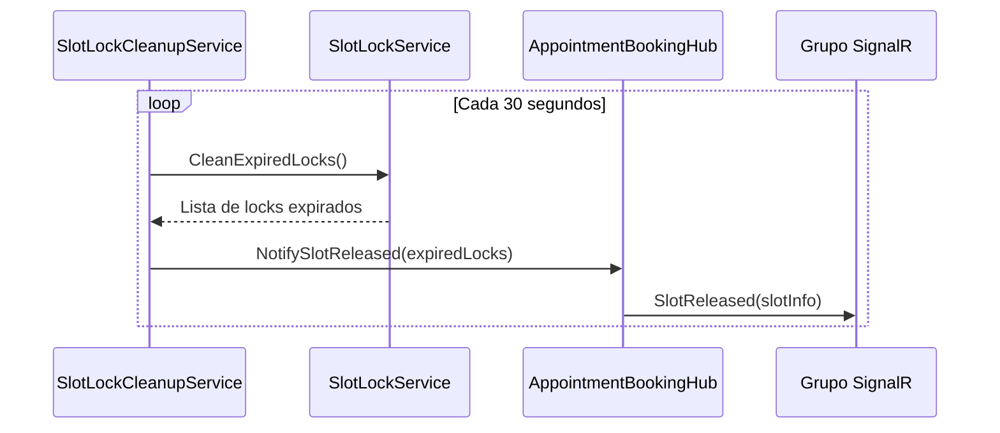
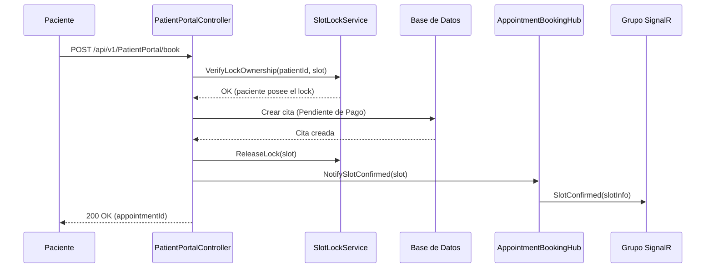

# Documento de Diseño Técnico — Bloqueo de Citas en Tiempo Real con SignalR

## Resumen General

Esta funcionalidad implementa un sistema de bloqueo temporal de horarios (slots) en tiempo real para el portal del paciente del HIS, utilizando SignalR como canal de comunicación bidireccional. El objetivo es prevenir la doble reservación de citas médicas cuando múltiples pacientes intentan agendar el mismo horario simultáneamente.

### Decisiones de Diseño Clave

1. **Almacenamiento en memoria con `ConcurrentDictionary`**: Los bloqueos temporales son transitorios por naturaleza (TTL de 5 minutos). Usar almacenamiento en memoria evita la latencia de base de datos y simplifica la implementación. Si el servidor se reinicia, los bloqueos se pierden pero las citas confirmadas persisten en BD.

2. **SignalR con grupos por doctor+fecha**: Solo los pacientes que están viendo el mismo doctor en la misma fecha reciben notificaciones, minimizando el tráfico de red y la carga del servidor.

3. **Validación dual (optimista + backend)**: El bloqueo en tiempo real es la primera línea de defensa, pero el backend valida la disponibilidad al momento de confirmar la cita como respaldo ante fallos de comunicación.

4. **Hook React reutilizable (`useAppointmentHub`)**: Encapsula toda la lógica de SignalR en un hook que se integra con Zustand, siguiendo los patrones existentes del proyecto.

## Arquitectura

### Diagrama de Arquitectura de Alto Nivel



### Diagrama de Flujo — Bloqueo de Slot



### Diagrama de Flujo — Expiración Automática



### Diagrama de Flujo — Confirmación de Cita



## Componentes e Interfaces

### Backend

#### 1. `ISlotLockService` — Interfaz del Servicio de Bloqueo

```csharp
// Hospital.Server/Services/Interfaces/ISlotLockService.cs
namespace Hospital.Server.Services.Interfaces;

public interface ISlotLockService
{
    /// <summary>
    /// Intenta bloquear un slot para un paciente. Libera automáticamente
    /// cualquier bloqueo previo del mismo paciente para el mismo doctor+fecha.
    /// </summary>
    SlotLockResult TryLockSlot(long doctorId, DateOnly date, TimeOnly time, 
                                long patientId, string connectionId);

    /// <summary>
    /// Libera el bloqueo de un slot específico si pertenece al paciente indicado.
    /// </summary>
    bool ReleaseSlot(long doctorId, DateOnly date, TimeOnly time, long patientId);

    /// <summary>
    /// Libera todos los bloqueos asociados a un connectionId (desconexión).
    /// </summary>
    List<SlotLockInfo> ReleaseAllByConnection(string connectionId);

    /// <summary>
    /// Limpia todos los bloqueos expirados y retorna la lista de los eliminados.
    /// </summary>
    List<SlotLockInfo> CleanExpiredLocks();

    /// <summary>
    /// Verifica si un paciente posee el bloqueo activo de un slot.
    /// </summary>
    bool VerifyLockOwnership(long doctorId, DateOnly date, TimeOnly time, long patientId);

    /// <summary>
    /// Obtiene todos los bloqueos activos para un doctor+fecha (estado inicial al unirse a grupo).
    /// </summary>
    List<SlotLockInfo> GetActiveLocksForGroup(long doctorId, DateOnly date);
}
```

#### 2. `SlotLockService` — Implementación con ConcurrentDictionary

```csharp
// Hospital.Server/Services/Core/SlotLockService.cs
namespace Hospital.Server.Services.Core;

public class SlotLockService : ISlotLockService
{
    // Clave: "doctor_{doctorId}_date_{yyyy-MM-dd}_time_{HH:mm}"
    private static readonly ConcurrentDictionary<string, SlotLockEntry> _locks = new();
    
    private const int LockTtlSeconds = 300; // 5 minutos
    
    // Implementación thread-safe usando ConcurrentDictionary
}
```

**Decisión**: Se usa `static readonly ConcurrentDictionary` para que el estado sea compartido entre todas las instancias del servicio (registrado como Scoped para inyección en el Hub). Esto garantiza que el diccionario sobreviva al ciclo de vida del scope de DI.

#### 3. `AppointmentBookingHub` — Hub de SignalR

```csharp
// Hospital.Server/Hubs/AppointmentBookingHub.cs
namespace Hospital.Server.Hubs;

[Authorize]
public class AppointmentBookingHub : Hub
{
    // Métodos invocables por el cliente
    public async Task JoinSlotGroup(long doctorId, string date);
    public async Task LeaveSlotGroup(long doctorId, string date);
    public async Task LockSlot(long doctorId, string date, string time);
    public async Task ReleaseSlot(long doctorId, string date, string time);
    
    // Override para limpieza al desconectar
    public override async Task OnDisconnectedAsync(Exception? exception);
}
```

#### 4. `SlotLockCleanupService` — Servicio de Limpieza en Background

```csharp
// Hospital.Server/Services/Background/SlotLockCleanupService.cs
namespace Hospital.Server.Services.Background;

public class SlotLockCleanupService : BackgroundService
{
    // Ejecuta limpieza cada 30 segundos
    // Usa IHubContext<AppointmentBookingHub> para notificar liberaciones
    private static readonly TimeSpan CleanupInterval = TimeSpan.FromSeconds(30);
}
```

**Decisión**: Se sigue el mismo patrón de `BackgroundService` usado en `AppointmentExpirationService`, con `IServiceProvider.CreateScope()` para resolver dependencias scoped.

#### 5. Hub Events — Eventos emitidos hacia los clientes

| Evento | Payload | Descripción |
|--------|---------|-------------|
| `SlotLocked` | `{ DoctorId, Date, Time, ExpiresAt }` | Un slot fue bloqueado por otro paciente |
| `SlotReleased` | `{ DoctorId, Date, Time }` | Un slot fue liberado (manual o expiración) |
| `SlotLockRejected` | `{ DoctorId, Date, Time, Reason }` | El intento de bloqueo fue rechazado |
| `SlotConfirmed` | `{ DoctorId, Date, Time }` | Un slot fue confirmado permanentemente (cita creada) |

### Frontend

#### 1. `useAppointmentHub` — Hook de React

```typescript
// hospital.client/src/hooks/useAppointmentHub.ts

interface UseAppointmentHubReturn {
  /** Estado de la conexión SignalR */
  connectionState: 'disconnected' | 'connecting' | 'connected' | 'reconnecting';
  /** Mapa de slots bloqueados: key = "HH:mm", value = SlotLockInfo */
  lockedSlots: Map<string, SlotLockInfo>;
  /** Slots confirmados permanentemente */
  confirmedSlots: Set<string>;
  /** Slot bloqueado por el paciente actual */
  myLockedSlot: string | null;
  /** Solicitar bloqueo de un slot */
  lockSlot: (time: string) => Promise<void>;
  /** Liberar el slot bloqueado por el paciente actual */
  releaseSlot: (time: string) => Promise<void>;
  /** Error de conexión o rechazo */
  error: string | null;
}

function useAppointmentHub(
  doctorId: number | null,
  date: string | null
): UseAppointmentHubReturn;
```

#### 2. Integración con `DynamicCalendar`

El componente `DynamicCalendar` se modificará para:
- Recibir los datos de `useAppointmentHub` como props o usarlo internamente
- Renderizar tres estados visuales de slots: disponible (verde), bloqueado por otro (amarillo/naranja), seleccionado propio (azul), ocupado/confirmado (gris)
- Mostrar tooltips accesibles en slots bloqueados

#### 3. Store de Zustand (opcional)

Si se necesita compartir el estado de bloqueos entre componentes, se puede crear un store `useSlotLockStore`. Sin embargo, dado que el hook `useAppointmentHub` ya encapsula el estado y el `DynamicCalendar` es el único consumidor directo, el estado se maneja dentro del hook para mantener la simplicidad. El hook accede a `usePatientAuthStore` solo para obtener el token JWT.

## Modelos de Datos

### Backend DTOs y Modelos

#### `SlotLockEntry` — Entrada interna del ConcurrentDictionary

```csharp
// Hospital.Server/Entities/Dtos/SlotLockEntry.cs
namespace Hospital.Server.Entities.Dtos;

public record SlotLockEntry(
    long DoctorId,
    DateOnly Date,
    TimeOnly Time,
    long PatientId,
    string ConnectionId,
    DateTime ExpiresAt
);
```

#### `SlotLockResult` — Resultado de intento de bloqueo

```csharp
// Hospital.Server/Entities/Dtos/SlotLockResult.cs
namespace Hospital.Server.Entities.Dtos;

public record SlotLockResult(
    bool Success,
    string? Reason = null,
    SlotLockInfo? LockInfo = null,
    SlotLockInfo? ReleasedPrevious = null
);
```

#### `SlotLockInfo` — Información de bloqueo para transmisión por SignalR

```csharp
// Hospital.Server/Entities/Dtos/SlotLockInfo.cs
namespace Hospital.Server.Entities.Dtos;

public record SlotLockInfo(
    long DoctorId,
    string Date,      // formato "yyyy-MM-dd"
    string Time,      // formato "HH:mm"
    DateTime ExpiresAt
);
```

#### Hub Request DTOs (implícitos en los parámetros del Hub)

| Método Hub | Parámetros | Descripción |
|------------|-----------|-------------|
| `JoinSlotGroup` | `long doctorId, string date` | Unirse al grupo `doctor_{id}_date_{date}` |
| `LeaveSlotGroup` | `long doctorId, string date` | Salir del grupo |
| `LockSlot` | `long doctorId, string date, string time` | Solicitar bloqueo del slot |
| `ReleaseSlot` | `long doctorId, string date, string time` | Liberar bloqueo del slot |

### Frontend Types

```typescript
// hospital.client/src/types/SlotLockTypes.ts

export interface SlotLockInfo {
  doctorId: number;
  date: string;       // "yyyy-MM-dd"
  time: string;       // "HH:mm"
  expiresAt: string;  // ISO 8601
}

export interface SlotLockRejection {
  doctorId: number;
  date: string;
  time: string;
  reason: string;
}

export type ConnectionState = 'disconnected' | 'connecting' | 'connected' | 'reconnecting';
```

### Estructura de Clave del ConcurrentDictionary

```
Formato: "doctor_{doctorId}_date_{yyyy-MM-dd}_time_{HH:mm}"
Ejemplo: "doctor_5_date_2025-07-15_time_09:30"
```

Esta clave compuesta garantiza unicidad por slot y permite búsquedas eficientes por prefijo para operaciones de grupo.


## Propiedades de Correctitud

*Una propiedad es una característica o comportamiento que debe mantenerse verdadero en todas las ejecuciones válidas de un sistema — esencialmente, una declaración formal sobre lo que el sistema debe hacer. Las propiedades sirven como puente entre especificaciones legibles por humanos y garantías de correctitud verificables por máquina.*

### Propiedad 1: Formato de nombre de grupo SignalR

*Para cualquier* `doctorId` (entero positivo) y `date` (fecha válida), el nombre del grupo generado SHALL seguir exactamente el formato `doctor_{doctorId}_date_{yyyy-MM-dd}`, donde la fecha usa ceros a la izquierda para mes y día.

**Valida: Requisitos 2.1**

### Propiedad 2: Creación de bloqueo almacena datos completos

*Para cualquier* combinación válida de `doctorId`, `date`, `time`, `patientId` y `connectionId`, cuando `TryLockSlot` tiene éxito, la entrada almacenada SHALL contener exactamente los mismos valores de `doctorId`, `date`, `time`, `patientId` y `connectionId` proporcionados, y el campo `ExpiresAt` SHALL ser una marca de tiempo futura.

**Valida: Requisitos 3.1, 9.2**

### Propiedad 3: Rechazo de conflicto — segundo intento de bloqueo falla

*Para cualquier* slot (definido por `doctorId`, `date`, `time`) y dos pacientes distintos `patientA` y `patientB`, si `patientA` bloquea exitosamente el slot, entonces el intento de `patientB` de bloquear el mismo slot SHALL ser rechazado mientras el bloqueo de `patientA` esté activo.

**Valida: Requisitos 3.3**

### Propiedad 4: Máximo un bloqueo activo por paciente por doctor+fecha

*Para cualquier* paciente y cualquier secuencia de operaciones `TryLockSlot` sobre el mismo `doctorId` y `date` con diferentes valores de `time`, después de cada operación exitosa, el paciente SHALL tener exactamente un bloqueo activo para ese doctor+fecha, y cualquier bloqueo previo del mismo paciente para ese doctor+fecha SHALL haber sido liberado.

**Valida: Requisitos 3.4, 5.1**

### Propiedad 5: Asignación de TTL de 300 segundos

*Para cualquier* bloqueo creado exitosamente por `TryLockSlot`, el campo `ExpiresAt` del bloqueo SHALL ser igual al momento de creación más 300 segundos (±2 segundos de tolerancia por tiempo de ejecución).

**Valida: Requisitos 4.1**

### Propiedad 6: Limpieza elimina solo bloqueos expirados

*Para cualquier* conjunto de bloqueos activos donde algunos tienen `ExpiresAt` en el pasado y otros en el futuro, al ejecutar `CleanExpiredLocks`, todos los bloqueos expirados SHALL ser eliminados y retornados, y todos los bloqueos no expirados SHALL permanecer intactos en el almacenamiento.

**Valida: Requisitos 4.2**

### Propiedad 7: Desconexión libera todos los bloqueos de la conexión

*Para cualquier* `connectionId` que posea N bloqueos activos (donde N ≥ 0), al ejecutar `ReleaseAllByConnection(connectionId)`, todos los N bloqueos SHALL ser eliminados del almacenamiento y retornados, y los bloqueos de otras conexiones SHALL permanecer intactos.

**Valida: Requisitos 2.3, 5.2**

### Propiedad 8: Reserva de cita requiere posesión de bloqueo

*Para cualquier* intento de reserva de cita con parámetros (`doctorId`, `date`, `time`, `patientId`), `VerifyLockOwnership` SHALL retornar `true` si y solo si existe un bloqueo activo no expirado para ese slot cuyo `PatientId` coincide con el solicitante.

**Valida: Requisitos 7.1, 7.2**

### Propiedad 9: Intentos concurrentes de bloqueo — exactamente un ganador

*Para cualquier* slot y N pacientes distintos (N ≥ 2) que intentan bloquear el mismo slot concurrentemente, exactamente uno SHALL tener éxito y los demás SHALL ser rechazados, sin condiciones de carrera ni bloqueos duplicados.

**Valida: Requisitos 7.4, 9.3**

## Manejo de Errores

### Backend

| Escenario | Código HTTP | Respuesta | Acción |
|-----------|-------------|-----------|--------|
| Intento de bloqueo en slot ya bloqueado | N/A (SignalR) | Evento `SlotLockRejected` con razón | El cliente muestra mensaje al usuario |
| Reserva sin bloqueo activo | 409 Conflict | `{ success: false, message: "Debe seleccionar un horario antes de reservar" }` | Redirigir al calendario |
| Reserva con slot ya confirmado en BD | 409 Conflict | `{ success: false, message: "El horario seleccionado ya no está disponible" }` | Refrescar disponibilidad |
| Cliente no autenticado intenta conectar al Hub | 401 Unauthorized | Conexión rechazada | Redirigir a login |
| Token JWT expirado durante conexión activa | N/A | Desconexión automática | Hook intenta reconexión, si falla redirige a login |
| Error interno en SlotLockService | 500 | `{ success: false, message: "Error interno del servidor" }` | Log del error, notificar al cliente |

### Frontend

| Escenario | Comportamiento |
|-----------|---------------|
| Conexión SignalR perdida | Mostrar indicador visual "Reconectando...", intentar reconexión exponencial (máx 5 intentos) |
| Reconexión fallida (5 intentos agotados) | Mostrar mensaje "No se pudo restablecer la conexión. Los horarios pueden no estar actualizados." con botón de reintento manual |
| Evento `SlotLockRejected` recibido | Mostrar toast/notificación "Este horario fue reservado por otro paciente" y actualizar estado visual del slot |
| Slot propio expirado (timer local) | Limpiar selección, mostrar mensaje "Tu reserva temporal ha expirado. Selecciona otro horario." |
| Error al invocar método del Hub | Reintentar una vez, si falla mostrar error genérico |

### Estrategia de Reconexión

```typescript
// Configuración de reconexión automática con backoff exponencial
const connection = new HubConnectionBuilder()
  .withUrl(`${API_URL}/hubs/appointment-booking`, {
    accessTokenFactory: () => usePatientAuthStore.getState().token,
  })
  .withAutomaticReconnect([0, 2000, 5000, 10000, 30000]) // 5 intentos
  .configureLogging(LogLevel.Warning)
  .build();
```

Al reconectarse exitosamente:
1. Re-unirse al grupo actual (`JoinSlotGroup`)
2. Solicitar estado actual de bloqueos del grupo (`GetActiveLocksForGroup`)
3. Sincronizar estado local con el servidor

## Estrategia de Testing

### Testing Dual: Unit Tests + Property-Based Tests

Esta funcionalidad se beneficia de ambos enfoques de testing:

#### Property-Based Tests (PBT)

Se utilizará **fast-check** (ya instalado en el proyecto como devDependency) para los tests de propiedades del frontend, y **FsCheck** o **xUnit** con generadores personalizados para el backend en C#.

**Configuración:**
- Mínimo **100 iteraciones** por test de propiedad
- Cada test referencia la propiedad del documento de diseño
- Formato de tag: **Feature: realtime-appointment-blocking, Property {N}: {descripción}**

**Propiedades a implementar como PBT:**

| Propiedad | Componente | Librería |
|-----------|-----------|----------|
| P1: Formato de grupo | Backend (SlotLockService) | xUnit + generadores |
| P2: Datos completos de bloqueo | Backend (SlotLockService) | xUnit + generadores |
| P3: Rechazo de conflicto | Backend (SlotLockService) | xUnit + generadores |
| P4: Máximo un bloqueo por paciente | Backend (SlotLockService) | xUnit + generadores |
| P5: TTL de 300 segundos | Backend (SlotLockService) | xUnit + generadores |
| P6: Limpieza de expirados | Backend (SlotLockService) | xUnit + generadores |
| P7: Liberación por desconexión | Backend (SlotLockService) | xUnit + generadores |
| P8: Verificación de posesión | Backend (SlotLockService) | xUnit + generadores |
| P9: Concurrencia — un ganador | Backend (SlotLockService) | xUnit + Task.WhenAll |

#### Unit Tests (Ejemplos y Edge Cases)

**Backend:**
- Hub acepta solo conexiones autenticadas (JWT)
- Hub registra ruta `/hubs/appointment-booking`
- Métodos del Hub existen y son invocables
- `BookAppointment` rechaza con 409 sin bloqueo activo
- Servidor reiniciado inicia con diccionario vacío
- Background service ejecuta limpieza cada 30 segundos

**Frontend:**
- Hook `useAppointmentHub` retorna interfaz completa
- Hook se conecta al montar y desconecta al desmontar
- `DynamicCalendar` renderiza tres estados visuales de slots
- Slots bloqueados por otros muestran tooltip accesible
- Slot propio muestra estilo azul diferenciado
- Reconexión automática con backoff exponencial configurada
- Integración con `usePatientAuthStore` para token JWT

#### Integration Tests

- Flujo completo: conectar → unirse a grupo → bloquear slot → confirmar cita
- Dos clientes en mismo grupo: uno bloquea, otro recibe notificación
- Expiración de bloqueo notifica a todos los clientes del grupo
- Cambio de grupo (doctor/fecha) limpia suscripción anterior

### Puntos de Integración con Código Existente

| Componente Existente | Modificación Requerida |
|---------------------|----------------------|
| `Program.cs` | Agregar `builder.Services.AddSignalR()`, `app.MapHub<AppointmentBookingHub>("/hubs/appointment-booking")` |
| `ServicesGroup.cs` | Registrar `ISlotLockService` como Singleton, `SlotLockCleanupService` como HostedService |
| `PatientPortalController.cs` | Modificar `BookAppointment` para verificar lock ownership antes de crear cita, inyectar `IHubContext` para notificar `SlotConfirmed` |
| `DynamicCalendar.tsx` | Integrar `useAppointmentHub`, agregar estados visuales de bloqueo |
| `patientPortalService.ts` | No requiere cambios (la comunicación de bloqueo es por SignalR, no REST) |
| `useReservationTimer.ts` | Sincronizar con el TTL del bloqueo SignalR (ambos 5 minutos) |
| `package.json` | Agregar dependencia `@microsoft/signalr` |
| `Hospital.Server.csproj` | El paquete `Microsoft.AspNetCore.SignalR` ya está incluido en ASP.NET Core 8 |
