# Design Document: Unit & Integration Test Coverage

## Overview

This design establishes a comprehensive test infrastructure and test suite for the Hospital Information System (HIS) to achieve 90%+ code coverage across both the .NET 8 backend and the React + TypeScript frontend. The system currently has no test projects, so this design covers the full lifecycle: project scaffolding, test utilities, base classes, and the testing strategy for all critical components.

The approach uses a dual-testing strategy:
- **Unit tests** for isolated logic (services, validators, interceptors, utilities)
- **Integration tests** for full-pipeline verification (HTTP endpoints, SignalR hubs, database sync)
- **Property-based tests** for pure functions and logic with wide input spaces (FilterTranslator, utility functions, state machine invariants)

## Architecture

```mermaid
graph TB
    subgraph "Backend Test Project: Hospital.Server.Tests"
        BT[xUnit Test Runner]
        BT --> UT[Unit Tests]
        BT --> IT[Integration Tests]
        BT --> PT[Property Tests]
        
        UT --> ES[EntityService Tests]
        UT --> FT[FilterTranslator Tests]
        UT --> SM[StateMachine Tests]
        UT --> VT[Validator Tests]
        UT --> AT[AuthService Tests]
        UT --> INT[Interceptor Tests]
        
        IT --> CT[CrudController Tests]
        IT --> OS[OperationSync Tests]
        IT --> ST[SignalR Hub Tests]
        IT --> SEC[Security Tests]
        
        PT --> FTP[FilterTranslator Properties]
        PT --> SMP[StateMachine Properties]
    end
    
    subgraph "Frontend Tests: hospital.client"
        VR[Vitest Runner]
        VR --> FUT[Utility Function Tests]
        VR --> ZT[Zod Schema Tests]
        VR --> ZST[Zustand Store Tests]
        VR --> CRT[Component Render Tests]
        VR --> FPT[Property Tests - fast-check]
        
        FPT --> LU[Luhn/CUI Properties]
        FPT --> DF[Date Format Properties]
        FPT --> CC[Currency/Change Properties]
    end
    
    subgraph "Shared Infrastructure"
        COV[Coverage Reports - Cobertura/lcov]
        CI[CI Pipeline - PR Coverage Gate]
    end
    
    BT --> COV
    VR --> COV
    COV --> CI
```



## Components and Interfaces

### Backend Test Infrastructure

#### 1. Hospital.Server.Tests Project

```
Hospital.Server.Tests/
├── Hospital.Server.Tests.csproj
├── Infrastructure/
│   ├── TestBase.cs                          # Base class with in-memory DB
│   ├── HospitalWebApplicationFactory.cs     # Custom WebApplicationFactory
│   ├── TestAuthHandler.cs                   # Test authentication handler
│   └── ServiceCollectionExtensions.cs       # DI helpers for tests
├── Unit/
│   ├── Services/
│   │   ├── EntityServiceTests.cs
│   │   ├── AuthServiceTests.cs
│   │   └── AppointmentStateMachineTests.cs
│   ├── Utils/
│   │   └── FilterTranslatorTests.cs
│   ├── Validators/
│   │   ├── UserValidatorTests.cs
│   │   ├── AppointmentValidatorTests.cs
│   │   ├── MedicineValidatorTests.cs
│   │   └── PaymentValidatorTests.cs
│   └── Interceptors/
│       ├── AppointmentInterceptorTests.cs
│       ├── UserInterceptorTests.cs
│       ├── InventoryMovementInterceptorTests.cs
│       ├── DispenseInterceptorTests.cs
│       ├── DoctorEventInterceptorTests.cs
│       ├── DoctorTaskInterceptorTests.cs
│       ├── LabOrderInterceptorTests.cs
│       ├── PrescriptionInterceptorTests.cs
│       └── MedicalConsultationInterceptorTests.cs
├── Integration/
│   ├── Controllers/
│   │   └── CrudControllerIntegrationTests.cs
│   ├── Services/
│   │   └── OperationSyncServiceTests.cs
│   ├── Security/
│   │   └── AuthorizationIntegrationTests.cs
│   └── Hubs/
│       └── AppointmentBookingHubTests.cs
└── Properties/
    └── FsCheck.cs                           # FsCheck configuration (if used)
```

#### 2. TestBase Class

```csharp
public abstract class TestBase : IDisposable
{
    protected DataContext DbContext { get; }
    
    protected TestBase()
    {
        var options = new DbContextOptionsBuilder<DataContext>()
            .UseInMemoryDatabase(databaseName: Guid.NewGuid().ToString())
            .Options;
        DbContext = new DataContext(options);
    }
    
    public void Dispose()
    {
        DbContext.Dispose();
        GC.SuppressFinalize(this);
    }
}
```

#### 3. HospitalWebApplicationFactory

```csharp
public class HospitalWebApplicationFactory : WebApplicationFactory<Program>
{
    private List<string> _operationKeys = new();
    
    public HospitalWebApplicationFactory WithOperationKeys(params string[] keys)
    {
        _operationKeys = keys.ToList();
        return this;
    }
    
    protected override void ConfigureWebHost(IWebHostBuilder builder)
    {
        builder.ConfigureServices(services =>
        {
            // Replace real DB with in-memory
            var descriptor = services.SingleOrDefault(
                d => d.ServiceType == typeof(DbContextOptions<DataContext>));
            if (descriptor != null) services.Remove(descriptor);
            
            services.AddDbContext<DataContext>(options =>
                options.UseInMemoryDatabase("TestDb_" + Guid.NewGuid()));
            
            // Replace auth with test scheme
            services.AddAuthentication("Test")
                .AddScheme<AuthenticationSchemeOptions, TestAuthHandler>("Test", null);
            
            // Configure test claims
            services.Configure<TestAuthOptions>(opts =>
            {
                opts.OperationKeys = _operationKeys;
            });
        });
    }
}
```

#### 4. TestAuthHandler

Generates a JWT-like ClaimsPrincipal with configurable claims:
- `ClaimTypes.NameIdentifier` → user ID
- `ClaimTypes.Email` → test email
- `ClaimTypes.Name` → test user name
- `"RoleName"` → test role
- `"OperationKey"` → one claim per configured operation key

### Frontend Test Infrastructure

#### 1. Vitest Configuration

```typescript
// vitest.config.ts (or inline in vite.config.ts)
export default defineConfig({
  test: {
    globals: true,
    environment: 'jsdom',
    setupFiles: ['./src/test-setup.ts'],
    coverage: {
      provider: 'v8',
      reporter: ['text', 'lcov'],
      exclude: [
        'vite.config.ts',
        'tailwind.config.*',
        '**/*.d.ts',
        '**/test-setup.*',
        '**/node_modules/**'
      ],
      thresholds: {
        lines: 90
      }
    }
  }
});
```

#### 2. Test Setup File

```typescript
// src/test-setup.ts
import '@testing-library/jest-dom/vitest';

// Mock localStorage
const localStorageMock = (() => {
  let store: Record<string, string> = {};
  return {
    getItem: (key: string) => store[key] ?? null,
    setItem: (key: string, value: string) => { store[key] = value; },
    removeItem: (key: string) => { delete store[key]; },
    clear: () => { store = {}; },
    get length() { return Object.keys(store).length; },
    key: (i: number) => Object.keys(store)[i] ?? null,
  };
})();
Object.defineProperty(window, 'localStorage', { value: localStorageMock });

// Mock matchMedia
Object.defineProperty(window, 'matchMedia', {
  value: (query: string) => ({
    matches: false,
    media: query,
    onchange: null,
    addListener: () => {},
    removeListener: () => {},
    addEventListener: () => {},
    removeEventListener: () => {},
    dispatchEvent: () => false,
  }),
});
```

#### 3. MSW Server Setup

```typescript
// src/test-utils/server.ts
import { setupServer } from 'msw/node';
export const server = setupServer();
```

## Data Models

### Test Data Factories (Backend)

```csharp
public static class TestDataFactory
{
    public static User CreateUser(long id = 1, string name = "Test User")
        => new User { Id = id, Name = name, Email = $"user{id}@test.com", 
                      State = 1, CreatedAt = DateTime.UtcNow, CreatedBy = 1 };
    
    public static Appointment CreateAppointment(long id = 1, long statusId = 1)
        => new Appointment { Id = id, AppointmentStatusId = statusId, 
                             State = 1, CreatedAt = DateTime.UtcNow, CreatedBy = 1 };
}
```

### Test Data Factories (Frontend)

```typescript
// src/test-utils/factories.ts
export const createMockUser = (overrides?: Partial<UserResponse>) => ({
  id: 1,
  name: 'Test User',
  email: 'test@hospital.com',
  state: 1,
  ...overrides,
});

export const createMockAppointment = (overrides?: Partial<AppointmentResponse>) => ({
  id: 1,
  patientId: 1,
  doctorId: 2,
  appointmentStatusId: 1,
  state: 1,
  ...overrides,
});
```

## Correctness Properties

*A property is a characteristic or behavior that should hold true across all valid executions of a system — essentially, a formal statement about what the system should do. Properties serve as the bridge between human-readable specifications and machine-verifiable correctness guarantees.*

### Property 1: FilterTranslator operator correctness

*For any* supported filter expression with a valid field name, operator (eq, ne, gt, lt, gte, lte, like, in, notin), and type-compatible value, the LINQ expression produced by `TranslateToEfFilter` SHALL correctly include entities that match the condition and exclude entities that do not match.

**Validates: Requirements 4.1, 4.2, 4.3, 4.4, 4.7, 4.10**

### Property 2: FilterTranslator AND/OR precedence

*For any* compound filter string containing both " AND " and " OR " combinators, the resulting expression tree SHALL evaluate AND with higher precedence than OR, such that `A OR B AND C` is equivalent to `A OR (B AND C)`.

**Validates: Requirements 4.5**

### Property 3: FilterTranslator null/empty identity

*For any* entity of any type, when a null or empty filter string is provided to `TranslateToEfFilter`, the resulting lambda SHALL evaluate to `true` (no filtering applied).

**Validates: Requirements 4.9**

### Property 4: AppointmentStateMachine invalid transitions are rejected

*For any* pair of status IDs (fromStatusId, toStatusId) where the pair is NOT present in the `_allowedTransitions` map, `CanTransition(fromStatusId, toStatusId)` SHALL return `false`, and `TransitionAsync` SHALL return `(false, error message)` without modifying the appointment's `AppointmentStatusId`.

**Validates: Requirements 5.2, 5.3, 5.7**

### Property 5: AppointmentStateMachine valid transitions succeed

*For any* active appointment (State == 1) and any valid transition pair present in `_allowedTransitions`, calling `TransitionAsync` SHALL update the appointment's `AppointmentStatusId` to the target status, set `UpdatedAt` to a recent UTC time, and set `UpdatedBy` to the provided user ID.

**Validates: Requirements 5.5**

### Property 6: EntityService Create preserves audit invariants

*For any* valid create request that passes validation, after `EntityService.Create` completes successfully, the persisted entity SHALL have `CreatedAt` set to approximately `DateTime.UtcNow`, `UpdatedAt` equal to `null`, and `UpdatedBy` equal to `null`.

**Validates: Requirements 3.1**

### Property 7: EntityService Update preserves CreatedAt

*For any* valid update or partial update request targeting an existing entity, after `EntityService.Update` or `EntityService.PartialUpdate` completes successfully, the entity's `CreatedAt` value SHALL remain identical to its value before the update, and `UpdatedAt` SHALL be set to approximately `DateTime.UtcNow`.

**Validates: Requirements 3.3, 3.5**

### Property 8: EntityService GetAll excludes soft-deleted records

*For any* dataset containing entities with `State == 0` (soft-deleted) and `State != 0` (active), calling `GetAll` with any filter string SHALL never return entities where `State == 0` in the response `Data` list.

**Validates: Requirements 3.9**

### Property 9: EntityService pagination correctness

*For any* dataset of N active entities and pagination parameters (pageNumber, pageSize) where pageNumber >= 1 and pageSize >= 1, `GetAll` SHALL return at most `pageSize` records, skip exactly `(pageNumber - 1) * pageSize` records from the ordered set, and when `includeTotal` is true, `TotalResults` SHALL equal the exact count of matching active entities.

**Validates: Requirements 3.10**

### Property 10: Luhn check correctness

*For any* numeric string of 13 to 19 digits where the Luhn checksum modulo 10 equals zero, `luhnCheck` SHALL return `true`; and *for any* string that fails any of these conditions (wrong length, non-digit characters, checksum ≠ 0), `luhnCheck` SHALL return `false`.

**Validates: Requirements 10.1, 10.2**

### Property 11: CUI validation correctness

*For any* 13-digit string where the department code (digits 10-11) is between 1 and 22, the municipality code (digits 12-13) is between 1 and the maximum for that department, and the check digit (digit 9) equals the sum-of-products modulo 11, `isCuiValid` SHALL return `true`; and *for any* input that violates any of these constraints, `isCuiValid` SHALL return `false`.

**Validates: Requirements 10.3, 10.4**

### Property 12: calculateChange avoids floating-point drift

*For any* two numeric values `amountReceived` and `amount`, `calculateChange(amountReceived, amount)` SHALL return a value equal to `(amountReceived - amount)` rounded to exactly 2 decimal places, with no floating-point drift (verified via integer arithmetic comparison).

**Validates: Requirements 10.8**

### Property 13: formatCurrency output format

*For any* numeric value `n`, `formatCurrency(n)` SHALL return a string matching the pattern `"Q "` followed by the number formatted with exactly 2 decimal places.

**Validates: Requirements 10.9**

### Property 14: formatLocalDateTime output format

*For any* valid JavaScript `Date` object, `formatLocalDateTime(date)` SHALL return a string in the format `"yyyy-MM-ddTHH:mm:ss"` using zero-padded local time components without UTC conversion.

**Validates: Requirements 10.7**

### Property 15: Zod schema round-trip validity

*For any* object that successfully passes `safeParse` against a Zod schema (loginSchema, registerSchema, appointmentSchema, paymentSchema), the parsed output SHALL be structurally equivalent to the input (no data loss or transformation beyond type coercion).

**Validates: Requirements 11.1, 11.3, 11.5, 11.7**

## Error Handling

### Backend Test Error Handling

| Scenario | Expected Behavior |
|----------|-------------------|
| In-memory DB connection failure | Test fails with clear DbContext initialization error |
| WebApplicationFactory startup failure | Test fails with host build error, logged to test output |
| Moq setup mismatch | Test fails with `MockException` indicating unexpected call |
| FluentAssertions mismatch | Test fails with descriptive comparison message |
| Test timeout (integration) | xUnit enforces 30s timeout per test method |

### Frontend Test Error Handling

| Scenario | Expected Behavior |
|----------|-------------------|
| Component render failure | Test fails with React error boundary message |
| MSW unhandled request | Test fails with warning about unmatched request |
| Zustand store isolation failure | Each test resets store via `useStore.setState()` |
| Async timeout | Vitest enforces 5s default timeout per test |

### Coverage Threshold Failures

- Backend: `coverlet` configured with `--threshold 90` flag — `dotnet test` exits with non-zero code if below threshold
- Frontend: Vitest `coverage.thresholds.lines: 90` — test run fails if below threshold
- CI: GitHub Actions workflow posts coverage summary as PR comment and fails the check if either project is below 90%

## Testing Strategy

### Backend Testing Stack

| Tool | Purpose | Version |
|------|---------|---------|
| xUnit | Test framework | 2.9.x |
| Moq | Mocking framework | 4.20.x |
| FluentAssertions | Assertion library | 7.x |
| Microsoft.EntityFrameworkCore.InMemory | In-memory DB for unit tests | 8.0.x |
| Microsoft.AspNetCore.Mvc.Testing | Integration test host | 8.0.x |
| coverlet.collector | Code coverage | 6.x |
| FsCheck.Xunit | Property-based testing | 3.x |

### Frontend Testing Stack

| Tool | Purpose | Version |
|------|---------|---------|
| Vitest | Test runner | 4.x (already installed) |
| @testing-library/react | Component testing | 16.x |
| @testing-library/jest-dom | DOM matchers | 6.x |
| @testing-library/user-event | User interaction simulation | 14.x |
| MSW | HTTP request mocking | 2.x |
| fast-check | Property-based testing | 4.x (already installed) |
| @vitest/coverage-v8 | Coverage provider | 4.x |

### Dual Testing Approach

- **Unit tests**: Verify specific examples, edge cases, and error conditions with concrete inputs
- **Property-based tests**: Verify universal properties across randomly generated inputs (minimum 100 iterations per property)
- Both are complementary — unit tests catch concrete bugs, property tests verify general correctness

### Property-Based Testing Configuration

**Backend (FsCheck.Xunit):**
- Each property test runs minimum 100 iterations
- Tag format: `// Feature: unit-integration-test-coverage, Property {N}: {description}`
- Properties target: FilterTranslator, AppointmentStateMachine, EntityService invariants

**Frontend (fast-check):**
- Each property test runs minimum 100 iterations via `fc.assert(fc.property(...), { numRuns: 100 })`
- Tag format: `// Feature: unit-integration-test-coverage, Property {N}: {description}`
- Properties target: luhnCheck, isCuiValid, calculateChange, formatCurrency, formatLocalDateTime, Zod schemas

### Coverage Configuration

**Backend (coverlet):**
```xml
<PropertyGroup>
  <CollectCoverage>true</CollectCoverage>
  <CoverletOutputFormat>cobertura</CoverletOutputFormat>
  <Threshold>90</Threshold>
  <ExcludeByFile>**/Migrations/**,**/obj/**,**/bin/**,**/*.Designer.cs</ExcludeByFile>
</PropertyGroup>
```

**Frontend (Vitest v8):**
```typescript
coverage: {
  provider: 'v8',
  reporter: ['text', 'lcov'],
  thresholds: { lines: 90 },
  exclude: ['vite.config.ts', 'tailwind.config.*', '**/*.d.ts', '**/test-setup.*', '**/node_modules/**']
}
```

### CI/CD Integration

A GitHub Actions workflow runs on pull requests:
1. `dotnet test` with coverage collection → Cobertura XML
2. `npm run test -- --coverage` → lcov report
3. Parse both reports, post summary as PR comment
4. Fail the check if either project is below 90% line coverage

### Test Isolation Strategy

- **Backend unit tests**: Each test gets a fresh in-memory database (unique name per test via `Guid.NewGuid()`)
- **Backend integration tests**: `WebApplicationFactory` creates isolated test server per test class; database is seeded per test
- **Frontend tests**: Zustand stores reset between tests; localStorage mock clears between tests; MSW handlers reset via `server.resetHandlers()`
